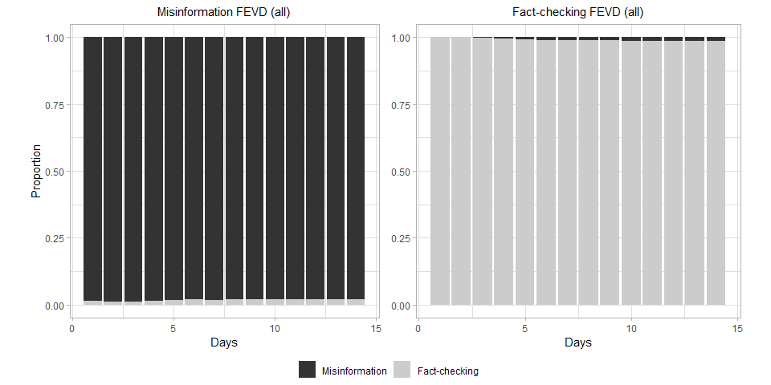

Demographics and Topics Impact on the Co-Spread of COVID-19
Misinformation and Fact-Checks on Twitter
================
Grégoire Burel, Tracie Farell and Harith Alani
31/01/2021

  - [Introduction](#introduction)
      - [Abstract](#abstract)
      - [Acknowledgements](#acknowledgements)
  - [Suplementary Material](#suplementary-material)
      - [General Statistics](#general-statistics)
      - [MANOVA/ANOVA Results](#manovaanova-results)
          - [Global Results](#global-results)
          - [Individual Results](#individual-results)
              - [Topics Analysis](#topics-analysis)
              - [User Gender Analysis](#user-gender-analysis)
              - [User Type Analysis](#user-type-analysis)
      - [Impact Analysis](#impact-analysis)
          - [All](#all)
          - [User Account Type](#user-account-type)
          - [User Age](#user-age)
          - [User Gender](#user-gender)
          - [Topic](#topic)

## Introduction

This document contains additional material for the the article entitled
*Demographics and Topics Impact on the Co-Spread of COVID-19
Misinformation and Fact-Checks on Twitter* submitted to the [*IPM
special issue on Dis/Misinformation mining from social
media*](https://www.journals.elsevier.com/information-processing-and-management/call-for-papers/special-issue-on-dismisinformation-mining-from-social-media).

This work is a major extension of our previous work on co-spread of
misinformation and fact-checks published last year at the [SocInfo
conference](http://oro.open.ac.uk/71786/). Compared to the previous
publication, our manuscript covers more than one year of the pandemic
and related fact-checks with an extended dataset that is nearly 17 times
larger than our previous dataset. We also extend our previous analysis
by investigating how misinformation and fact-check spreads according to
different COVID-19-related topics, user demographics and attributes.

### Abstract

Correcting misconceptions and false beliefs are important for injecting
reliable information about COVID-19 into public discourse, but what
impact does this have on the continued proliferation of misinforming
claims? Fact-checking organisations produce content with the aim of
reducing misinformation spread, but our knowledge of its impact on
misinformation for particular topics and demographics is limited. In
this article, we explore the relation between misinformation and
fact-checking spread during the COVID-19 pandemic for different topics,
user demographics and attributes. We specifically follow misinformation
and fact-checks emerging from December 2019 until the 4th January 2021
on Twitter. Using a combination of spread variance analysis, impulse
response modelling and causal analysis, we highlight the bidirectional
weak causation spread behaviour between misinformation and fact-checks.
Although we observe that fact-checks about COVID-19 are appearing fairly
quickly after misinformation is circulated, its ability to reduce
overall misinformation spread appears to be limited. This is especially
visible for misinformation about conspiracy theories and the causes of
the virus.

### Acknowledgements

This work has received support from the European Union’s Horizon 2020
research and innovation programme under grants agreement No 770302
([Co-Inform](https://coinform.eu/)) and No 101003606
([HERoS](https://www.heros-project.eu/)).

## Suplementary Material

The following section reports on the different results associated with
the article analysis. The results are provided as is and not dicussed.

### General Statistics

General results concerning the distribution of misinformation and
fact-checks.

<!-- -->

<!-- -->

### MANOVA/ANOVA Results

For the first part of the analysis, we identify the different patterns
of appearance of misinformation and fact-check URLs over varying periods
of time for all the shared URLs and for different topics and demographic
groups. This analysis is done using the one way Multivariate ANalysis Of
VAriance (MANOVA) and the one way ANalysis Of VAriance (ANOVA) methods.
Depending on the group analysed, Dunn post-hocs tests are also performed
in order to better understand where spread patterns differ within
different sub-groups. This approach allows us to determine if there are
significant differences in information spread between the fact-checking
information and misinformation groups in each *initial*, *early* and
*late* periods.

#### Global Results

<table class="table table-striped table-hover" style="margin-left: auto; margin-right: auto;">

<thead>

<tr>

<th style="text-align:left;">

test

</th>

<th style="text-align:right;">

Test Statistic

</th>

<th style="text-align:right;">

df1

</th>

<th style="text-align:right;">

df2

</th>

<th style="text-align:left;">

P-value

</th>

<th style="text-align:left;">

Permutation Test p-value

</th>

</tr>

</thead>

<tbody>

<tr>

<td style="text-align:left;">

ANOVA type test p-value

</td>

<td style="text-align:right;">

573.895

</td>

<td style="text-align:right;">

1.824

</td>

<td style="text-align:right;">

55570.26

</td>

<td style="text-align:left;">

0

</td>

<td style="text-align:left;">

0

</td>

</tr>

</tbody>

</table>

<table class="table table-striped table-hover" style="margin-left: auto; margin-right: auto;">

<thead>

<tr>

<th style="text-align:left;">

variable

</th>

<th style="text-align:left;">

.y.

</th>

<th style="text-align:right;">

n

</th>

<th style="text-align:right;">

statistic

</th>

<th style="text-align:right;">

df

</th>

<th style="text-align:left;">

p

</th>

<th style="text-align:left;">

method

</th>

<th style="text-align:left;">

adjusted p

</th>

</tr>

</thead>

<tbody>

<tr>

<td style="text-align:left;">

initial

</td>

<td style="text-align:left;">

value

</td>

<td style="text-align:right;">

48219

</td>

<td style="text-align:right;">

322.4509312

</td>

<td style="text-align:right;">

1

</td>

<td style="text-align:left;">

4.24e-72

</td>

<td style="text-align:left;">

Kruskal-Wallis

</td>

<td style="text-align:left;">

1.272e-71

</td>

</tr>

<tr>

<td style="text-align:left;">

early

</td>

<td style="text-align:left;">

value

</td>

<td style="text-align:right;">

48219

</td>

<td style="text-align:right;">

0.1260069

</td>

<td style="text-align:right;">

1

</td>

<td style="text-align:left;">

0.723

</td>

<td style="text-align:left;">

Kruskal-Wallis

</td>

<td style="text-align:left;">

1

</td>

</tr>

<tr>

<td style="text-align:left;">

late

</td>

<td style="text-align:left;">

value

</td>

<td style="text-align:right;">

48219

</td>

<td style="text-align:right;">

1095.2433082

</td>

<td style="text-align:right;">

1

</td>

<td style="text-align:left;">

3.57e-240

</td>

<td style="text-align:left;">

Kruskal-Wallis

</td>

<td style="text-align:left;">

1.071e-239

</td>

</tr>

</tbody>

</table>

<table class="table table-striped table-hover" style="margin-left: auto; margin-right: auto;">

<thead>

<tr>

<th style="text-align:left;">

variable

</th>

<th style="text-align:left;">

group1

</th>

<th style="text-align:left;">

group2

</th>

<th style="text-align:left;">

p

</th>

<th style="text-align:left;">

p.adj

</th>

<th style="text-align:left;">

p.adj.signif

</th>

</tr>

</thead>

<tbody>

<tr>

<td style="text-align:left;">

early

</td>

<td style="text-align:left;">

fc-post

</td>

<td style="text-align:left;">

fc-review

</td>

<td style="text-align:left;">

0.722608712913768

</td>

<td style="text-align:left;">

0.722608712913768

</td>

<td style="text-align:left;">

</td>

</tr>

<tr>

<td style="text-align:left;">

initial

</td>

<td style="text-align:left;">

fc-post

</td>

<td style="text-align:left;">

fc-review

</td>

<td style="text-align:left;">

4.2368357452445e-72

</td>

<td style="text-align:left;">

4.2368357452445e-72

</td>

<td style="text-align:left;">

\*\*\*\*

</td>

</tr>

<tr>

<td style="text-align:left;">

late

</td>

<td style="text-align:left;">

fc-post

</td>

<td style="text-align:left;">

fc-review

</td>

<td style="text-align:left;">

3.57047984125626e-240

</td>

<td style="text-align:left;">

3.57047984125626e-240

</td>

<td style="text-align:left;">

\*\*\*\*

</td>

</tr>

</tbody>

</table>

<!-- -->

#### Individual Results

##### Topics Analysis

<table class="table table-striped table-hover" style="margin-left: auto; margin-right: auto;">

<thead>

<tr>

<th style="text-align:left;">

test

</th>

<th style="text-align:right;">

Test Statistic

</th>

<th style="text-align:right;">

df1

</th>

<th style="text-align:right;">

df2

</th>

<th style="text-align:left;">

P-value

</th>

<th style="text-align:left;">

Permutation Test p-value

</th>

</tr>

</thead>

<tbody>

<tr>

<td style="text-align:left;">

ANOVA type test p-value

</td>

<td style="text-align:right;">

3.175

</td>

<td style="text-align:right;">

19.997

</td>

<td style="text-align:right;">

1585.444

</td>

<td style="text-align:left;">

0

</td>

<td style="text-align:left;">

0.02

</td>

</tr>

<tr>

<td style="text-align:left;">

McKeon approx. for the Lawley Hotelling Test

</td>

<td style="text-align:right;">

8.966

</td>

<td style="text-align:right;">

33.000

</td>

<td style="text-align:right;">

12232.225

</td>

<td style="text-align:left;">

0

</td>

<td style="text-align:left;">

0

</td>

</tr>

<tr>

<td style="text-align:left;">

Muller approx. for the Bartlett-Nanda-Pillai Test

</td>

<td style="text-align:right;">

8.868

</td>

<td style="text-align:right;">

33.027

</td>

<td style="text-align:right;">

15753.983

</td>

<td style="text-align:left;">

0

</td>

<td style="text-align:left;">

0

</td>

</tr>

<tr>

<td style="text-align:left;">

Wilks Lambda

</td>

<td style="text-align:right;">

8.919

</td>

<td style="text-align:right;">

33.000

</td>

<td style="text-align:right;">

15456.385

</td>

<td style="text-align:left;">

0

</td>

<td style="text-align:left;">

0

</td>

</tr>

</tbody>

</table>

<table class="table table-striped table-hover" style="margin-left: auto; margin-right: auto;">

<thead>

<tr>

<th style="text-align:left;">

variable

</th>

<th style="text-align:left;">

.y.

</th>

<th style="text-align:right;">

n

</th>

<th style="text-align:right;">

statistic

</th>

<th style="text-align:right;">

df

</th>

<th style="text-align:left;">

p

</th>

<th style="text-align:left;">

method

</th>

<th style="text-align:left;">

adjusted p

</th>

</tr>

</thead>

<tbody>

<tr>

<td style="text-align:left;">

initial

</td>

<td style="text-align:left;">

value

</td>

<td style="text-align:right;">

5260

</td>

<td style="text-align:right;">

139.32403

</td>

<td style="text-align:right;">

11

</td>

<td style="text-align:left;">

2.24e-24

</td>

<td style="text-align:left;">

Kruskal-Wallis

</td>

<td style="text-align:left;">

6.72e-24

</td>

</tr>

<tr>

<td style="text-align:left;">

early

</td>

<td style="text-align:left;">

value

</td>

<td style="text-align:right;">

5260

</td>

<td style="text-align:right;">

52.94129

</td>

<td style="text-align:right;">

11

</td>

<td style="text-align:left;">

1.84e-07

</td>

<td style="text-align:left;">

Kruskal-Wallis

</td>

<td style="text-align:left;">

5.52e-07

</td>

</tr>

<tr>

<td style="text-align:left;">

late

</td>

<td style="text-align:left;">

value

</td>

<td style="text-align:right;">

5260

</td>

<td style="text-align:right;">

89.23128

</td>

<td style="text-align:right;">

11

</td>

<td style="text-align:left;">

2.36e-14

</td>

<td style="text-align:left;">

Kruskal-Wallis

</td>

<td style="text-align:left;">

7.08e-14

</td>

</tr>

</tbody>

</table>

<table class="table table-striped table-hover" style="margin-left: auto; margin-right: auto;">

<thead>

<tr>

<th style="text-align:left;">

variable

</th>

<th style="text-align:left;">

group1

</th>

<th style="text-align:left;">

group2

</th>

<th style="text-align:left;">

p

</th>

<th style="text-align:left;">

p.adj

</th>

<th style="text-align:left;">

p.adj.signif

</th>

</tr>

</thead>

<tbody>

<tr>

<td style="text-align:left;">

early

</td>

<td style="text-align:left;">

fc-post + Authorities

</td>

<td style="text-align:left;">

fc-post + Causes

</td>

<td style="text-align:left;">

0.833747491023292

</td>

<td style="text-align:left;">

1

</td>

<td style="text-align:left;">

</td>

</tr>

<tr>

<td style="text-align:left;">

early

</td>

<td style="text-align:left;">

fc-post + Authorities

</td>

<td style="text-align:left;">

fc-post + Conspiracy Theory

</td>

<td style="text-align:left;">

0.00620536453678842

</td>

<td style="text-align:left;">

0.409554059428036

</td>

<td style="text-align:left;">

</td>

</tr>

<tr>

<td style="text-align:left;">

early

</td>

<td style="text-align:left;">

fc-post + Authorities

</td>

<td style="text-align:left;">

fc-post + Cure

</td>

<td style="text-align:left;">

0.944338154449951

</td>

<td style="text-align:left;">

1

</td>

<td style="text-align:left;">

</td>

</tr>

<tr>

<td style="text-align:left;">

early

</td>

<td style="text-align:left;">

fc-post + Authorities

</td>

<td style="text-align:left;">

fc-post + Spread

</td>

<td style="text-align:left;">

0.175174429701783

</td>

<td style="text-align:left;">

1

</td>

<td style="text-align:left;">

</td>

</tr>

<tr>

<td style="text-align:left;">

early

</td>

<td style="text-align:left;">

fc-post + Authorities

</td>

<td style="text-align:left;">

fc-post + Symptoms

</td>

<td style="text-align:left;">

0.153351782707266

</td>

<td style="text-align:left;">

1

</td>

<td style="text-align:left;">

</td>

</tr>

<tr>

<td style="text-align:left;">

early

</td>

<td style="text-align:left;">

fc-post + Authorities

</td>

<td style="text-align:left;">

fc-review + Authorities

</td>

<td style="text-align:left;">

0.385956902441483

</td>

<td style="text-align:left;">

1

</td>

<td style="text-align:left;">

</td>

</tr>

<tr>

<td style="text-align:left;">

early

</td>

<td style="text-align:left;">

fc-post + Authorities

</td>

<td style="text-align:left;">

fc-review + Causes

</td>

<td style="text-align:left;">

1.82401427105747e-05

</td>

<td style="text-align:left;">

0.00120384941889793

</td>

<td style="text-align:left;">

\*\*

</td>

</tr>

<tr>

<td style="text-align:left;">

early

</td>

<td style="text-align:left;">

fc-post + Authorities

</td>

<td style="text-align:left;">

fc-review + Conspiracy Theory

</td>

<td style="text-align:left;">

5.13261507580722e-05

</td>

<td style="text-align:left;">

0.00338752595003277

</td>

<td style="text-align:left;">

\*\*

</td>

</tr>

<tr>

<td style="text-align:left;">

early

</td>

<td style="text-align:left;">

fc-post + Authorities

</td>

<td style="text-align:left;">

fc-review + Cure

</td>

<td style="text-align:left;">

0.0404625058216282

</td>

<td style="text-align:left;">

1

</td>

<td style="text-align:left;">

</td>

</tr>

<tr>

<td style="text-align:left;">

early

</td>

<td style="text-align:left;">

fc-post + Authorities

</td>

<td style="text-align:left;">

fc-review + Spread

</td>

<td style="text-align:left;">

0.170627880585647

</td>

<td style="text-align:left;">

1

</td>

<td style="text-align:left;">

</td>

</tr>

<tr>

<td style="text-align:left;">

early

</td>

<td style="text-align:left;">

fc-post + Authorities

</td>

<td style="text-align:left;">

fc-review + Symptoms

</td>

<td style="text-align:left;">

0.509341252722568

</td>

<td style="text-align:left;">

1

</td>

<td style="text-align:left;">

</td>

</tr>

<tr>

<td style="text-align:left;">

early

</td>

<td style="text-align:left;">

fc-post + Causes

</td>

<td style="text-align:left;">

fc-post + Conspiracy Theory

</td>

<td style="text-align:left;">

0.259917157889994

</td>

<td style="text-align:left;">

1

</td>

<td style="text-align:left;">

</td>

</tr>

<tr>

<td style="text-align:left;">

early

</td>

<td style="text-align:left;">

fc-post + Causes

</td>

<td style="text-align:left;">

fc-post + Cure

</td>

<td style="text-align:left;">

0.81020956049095

</td>

<td style="text-align:left;">

1

</td>

<td style="text-align:left;">

</td>

</tr>

<tr>

<td style="text-align:left;">

early

</td>

<td style="text-align:left;">

fc-post + Causes

</td>

<td style="text-align:left;">

fc-post + Spread

</td>

<td style="text-align:left;">

0.345334935304258

</td>

<td style="text-align:left;">

1

</td>

<td style="text-align:left;">

</td>

</tr>

<tr>

<td style="text-align:left;">

early

</td>

<td style="text-align:left;">

fc-post + Causes

</td>

<td style="text-align:left;">

fc-post + Symptoms

</td>

<td style="text-align:left;">

0.304280938809865

</td>

<td style="text-align:left;">

1

</td>

<td style="text-align:left;">

</td>

</tr>

<tr>

<td style="text-align:left;">

early

</td>

<td style="text-align:left;">

fc-post + Causes

</td>

<td style="text-align:left;">

fc-review + Authorities

</td>

<td style="text-align:left;">

0.651673342769119

</td>

<td style="text-align:left;">

1

</td>

<td style="text-align:left;">

</td>

</tr>

<tr>

<td style="text-align:left;">

early

</td>

<td style="text-align:left;">

fc-post + Causes

</td>

<td style="text-align:left;">

fc-review + Causes

</td>

<td style="text-align:left;">

9.19571642432595e-05

</td>

<td style="text-align:left;">

0.00606917284005513

</td>

<td style="text-align:left;">

\*\*

</td>

</tr>

<tr>

<td style="text-align:left;">

early

</td>

<td style="text-align:left;">

fc-post + Causes

</td>

<td style="text-align:left;">

fc-review + Conspiracy Theory

</td>

<td style="text-align:left;">

0.00434678560124477

</td>

<td style="text-align:left;">

0.286887849682155

</td>

<td style="text-align:left;">

</td>

</tr>

<tr>

<td style="text-align:left;">

early

</td>

<td style="text-align:left;">

fc-post + Causes

</td>

<td style="text-align:left;">

fc-review + Cure

</td>

<td style="text-align:left;">

0.147608567658728

</td>

<td style="text-align:left;">

1

</td>

<td style="text-align:left;">

</td>

</tr>

<tr>

<td style="text-align:left;">

early

</td>

<td style="text-align:left;">

fc-post + Causes

</td>

<td style="text-align:left;">

fc-review + Spread

</td>

<td style="text-align:left;">

0.317634588492676

</td>

<td style="text-align:left;">

1

</td>

<td style="text-align:left;">

</td>

</tr>

<tr>

<td style="text-align:left;">

early

</td>

<td style="text-align:left;">

fc-post + Causes

</td>

<td style="text-align:left;">

fc-review + Symptoms

</td>

<td style="text-align:left;">

0.561557821107669

</td>

<td style="text-align:left;">

1

</td>

<td style="text-align:left;">

</td>

</tr>

<tr>

<td style="text-align:left;">

early

</td>

<td style="text-align:left;">

fc-post + Conspiracy Theory

</td>

<td style="text-align:left;">

fc-post + Cure

</td>

<td style="text-align:left;">

0.0090121841629641

</td>

<td style="text-align:left;">

0.594804154755631

</td>

<td style="text-align:left;">

</td>

</tr>

<tr>

<td style="text-align:left;">

early

</td>

<td style="text-align:left;">

fc-post + Conspiracy Theory

</td>

<td style="text-align:left;">

fc-post + Spread

</td>

<td style="text-align:left;">

0.000476112633271222

</td>

<td style="text-align:left;">

0.0314234337959007

</td>

<td style="text-align:left;">

  - 
    
    </td>
    
    </tr>
    
    <tr>
    
    <td style="text-align:left;">
    
    early
    
    </td>
    
    <td style="text-align:left;">
    
    fc-post + Conspiracy Theory
    
    </td>
    
    <td style="text-align:left;">
    
    fc-post + Symptoms
    
    </td>
    
    <td style="text-align:left;">
    
    0.733807286124306
    
    </td>
    
    <td style="text-align:left;">
    
    1
    
    </td>
    
    <td style="text-align:left;">
    
    </td>
    
    </tr>
    
    <tr>
    
    <td style="text-align:left;">
    
    early
    
    </td>
    
    <td style="text-align:left;">
    
    fc-post + Conspiracy Theory
    
    </td>
    
    <td style="text-align:left;">
    
    fc-review + Authorities
    
    </td>
    
    <td style="text-align:left;">
    
    0.532223944054059
    
    </td>
    
    <td style="text-align:left;">
    
    1
    
    </td>
    
    <td style="text-align:left;">
    
    </td>
    
    </tr>
    
    <tr>
    
    <td style="text-align:left;">
    
    early
    
    </td>
    
    <td style="text-align:left;">
    
    fc-post + Conspiracy Theory
    
    </td>
    
    <td style="text-align:left;">
    
    fc-review + Causes
    
    </td>
    
    <td style="text-align:left;">
    
    0.000231384698173599
    
    </td>
    
    <td style="text-align:left;">
    
    0.0152713900794575
    
    </td>
    
    <td style="text-align:left;">
    
      - 
        
        </td>
        
        </tr>
        
        <tr>
        
        <td style="text-align:left;">
        
        early
        
        </td>
        
        <td style="text-align:left;">
        
        fc-post + Conspiracy Theory
        
        </td>
        
        <td style="text-align:left;">
        
        fc-review + Conspiracy Theory
        
        </td>
        
        <td style="text-align:left;">
        
        0.00857352401721933
        
        </td>
        
        <td style="text-align:left;">
        
        0.565852585136476
        
        </td>
        
        <td style="text-align:left;">
        
        </td>
        
        </tr>
        
        <tr>
        
        <td style="text-align:left;">
        
        early
        
        </td>
        
        <td style="text-align:left;">
        
        fc-post + Conspiracy Theory
        
        </td>
        
        <td style="text-align:left;">
        
        fc-review + Cure
        
        </td>
        
        <td style="text-align:left;">
        
        0.418573794512957
        
        </td>
        
        <td style="text-align:left;">
        
        1
        
        </td>
        
        <td style="text-align:left;">
        
        </td>
        
        </tr>
        
        <tr>
        
        <td style="text-align:left;">
        
        early
        
        </td>
        
        <td style="text-align:left;">
        
        fc-post + Conspiracy Theory
        
        </td>
        
        <td style="text-align:left;">
        
        fc-review + Spread
        
        </td>
        
        <td style="text-align:left;">
        
        0.743691555687544
        
        </td>
        
        <td style="text-align:left;">
        
        1
        
        </td>
        
        <td style="text-align:left;">
        
        </td>
        
        </tr>
        
        <tr>
        
        <td style="text-align:left;">
        
        early
        
        </td>
        
        <td style="text-align:left;">
        
        fc-post + Conspiracy Theory
        
        </td>
        
        <td style="text-align:left;">
        
        fc-review + Symptoms
        
        </td>
        
        <td style="text-align:left;">
        
        0.788556526347708
        
        </td>
        
        <td style="text-align:left;">
        
        1
        
        </td>
        
        <td style="text-align:left;">
        
        </td>
        
        </tr>
        
        <tr>
        
        <td style="text-align:left;">
        
        early
        
        </td>
        
        <td style="text-align:left;">
        
        fc-post + Cure
        
        </td>
        
        <td style="text-align:left;">
        
        fc-post + Spread
        
        </td>
        
        <td style="text-align:left;">
        
        0.218697433524683
        
        </td>
        
        <td style="text-align:left;">
        
        1
        
        </td>
        
        <td style="text-align:left;">
        
        </td>
        
        </tr>
        
        <tr>
        
        <td style="text-align:left;">
        
        early
        
        </td>
        
        <td style="text-align:left;">
        
        fc-post + Cure
        
        </td>
        
        <td style="text-align:left;">
        
        fc-post + Symptoms
        
        </td>
        
        <td style="text-align:left;">
        
        0.150378133650439
        
        </td>
        
        <td style="text-align:left;">
        
        1
        
        </td>
        
        <td style="text-align:left;">
        
        </td>
        
        </tr>
        
        <tr>
        
        <td style="text-align:left;">
        
        early
        
        </td>
        
        <td style="text-align:left;">
        
        fc-post + Cure
        
        </td>
        
        <td style="text-align:left;">
        
        fc-review + Authorities
        
        </td>
        
        <td style="text-align:left;">
        
        0.376129757176638
        
        </td>
        
        <td style="text-align:left;">
        
        1
        
        </td>
        
        <td style="text-align:left;">
        
        </td>
        
        </tr>
        
        <tr>
        
        <td style="text-align:left;">
        
        early
        
        </td>
        
        <td style="text-align:left;">
        
        fc-post + Cure
        
        </td>
        
        <td style="text-align:left;">
        
        fc-review + Causes
        
        </td>
        
        <td style="text-align:left;">
        
        1.82662690730678e-05
        
        </td>
        
        <td style="text-align:left;">
        
        0.00120557375882247
        
        </td>
        
        <td style="text-align:left;">
        
        \*\*
        
        </td>
        
        </tr>
        
        <tr>
        
        <td style="text-align:left;">
        
        early
        
        </td>
        
        <td style="text-align:left;">
        
        fc-post + Cure
        
        </td>
        
        <td style="text-align:left;">
        
        fc-review + Conspiracy Theory
        
        </td>
        
        <td style="text-align:left;">
        
        6.14529813122821e-05
        
        </td>
        
        <td style="text-align:left;">
        
        0.00405589676661062
        
        </td>
        
        <td style="text-align:left;">
        
        \*\*
        
        </td>
        
        </tr>
        
        <tr>
        
        <td style="text-align:left;">
        
        early
        
        </td>
        
        <td style="text-align:left;">
        
        fc-post + Cure
        
        </td>
        
        <td style="text-align:left;">
        
        fc-review + Cure
        
        </td>
        
        <td style="text-align:left;">
        
        0.0404889879651278
        
        </td>
        
        <td style="text-align:left;">
        
        1
        
        </td>
        
        <td style="text-align:left;">
        
        </td>
        
        </tr>
        
        <tr>
        
        <td style="text-align:left;">
        
        early
        
        </td>
        
        <td style="text-align:left;">
        
        fc-post + Cure
        
        </td>
        
        <td style="text-align:left;">
        
        fc-review + Spread
        
        </td>
        
        <td style="text-align:left;">
        
        0.167133184503772
        
        </td>
        
        <td style="text-align:left;">
        
        1
        
        </td>
        
        <td style="text-align:left;">
        
        </td>
        
        </tr>
        
        <tr>
        
        <td style="text-align:left;">
        
        early
        
        </td>
        
        <td style="text-align:left;">
        
        fc-post + Cure
        
        </td>
        
        <td style="text-align:left;">
        
        fc-review + Symptoms
        
        </td>
        
        <td style="text-align:left;">
        
        0.503596710639875
        
        </td>
        
        <td style="text-align:left;">
        
        1
        
        </td>
        
        <td style="text-align:left;">
        
        </td>
        
        </tr>
        
        <tr>
        
        <td style="text-align:left;">
        
        early
        
        </td>
        
        <td style="text-align:left;">
        
        fc-post + Spread
        
        </td>
        
        <td style="text-align:left;">
        
        fc-post + Symptoms
        
        </td>
        
        <td style="text-align:left;">
        
        0.0476694857883554
        
        </td>
        
        <td style="text-align:left;">
        
        1
        
        </td>
        
        <td style="text-align:left;">
        
        </td>
        
        </tr>
        
        <tr>
        
        <td style="text-align:left;">
        
        early
        
        </td>
        
        <td style="text-align:left;">
        
        fc-post + Spread
        
        </td>
        
        <td style="text-align:left;">
        
        fc-review + Authorities
        
        </td>
        
        <td style="text-align:left;">
        
        0.105053608419551
        
        </td>
        
        <td style="text-align:left;">
        
        1
        
        </td>
        
        <td style="text-align:left;">
        
        </td>
        
        </tr>
        
        <tr>
        
        <td style="text-align:left;">
        
        early
        
        </td>
        
        <td style="text-align:left;">
        
        fc-post + Spread
        
        </td>
        
        <td style="text-align:left;">
        
        fc-review + Causes
        
        </td>
        
        <td style="text-align:left;">
        
        4.78124470555057e-06
        
        </td>
        
        <td style="text-align:left;">
        
        0.000315562150566338
        
        </td>
        
        <td style="text-align:left;">
        
        \*\*\*
        
        </td>
        
        </tr>
        
        <tr>
        
        <td style="text-align:left;">
        
        early
        
        </td>
        
        <td style="text-align:left;">
        
        fc-post + Spread
        
        </td>
        
        <td style="text-align:left;">
        
        fc-review + Conspiracy Theory
        
        </td>
        
        <td style="text-align:left;">
        
        5.29261975021784e-06
        
        </td>
        
        <td style="text-align:left;">
        
        0.000349312903514378
        
        </td>
        
        <td style="text-align:left;">
        
        \*\*\*
        
        </td>
        
        </tr>
        
        <tr>
        
        <td style="text-align:left;">
        
        early
        
        </td>
        
        <td style="text-align:left;">
        
        fc-post + Spread
        
        </td>
        
        <td style="text-align:left;">
        
        fc-review + Cure
        
        </td>
        
        <td style="text-align:left;">
        
        0.00857079406270338
        
        </td>
        
        <td style="text-align:left;">
        
        0.565672408138423
        
        </td>
        
        <td style="text-align:left;">
        
        </td>
        
        </tr>
        
        <tr>
        
        <td style="text-align:left;">
        
        early
        
        </td>
        
        <td style="text-align:left;">
        
        fc-post + Spread
        
        </td>
        
        <td style="text-align:left;">
        
        fc-review + Spread
        
        </td>
        
        <td style="text-align:left;">
        
        0.0566253526796077
        
        </td>
        
        <td style="text-align:left;">
        
        1
        
        </td>
        
        <td style="text-align:left;">
        
        </td>
        
        </tr>
        
        <tr>
        
        <td style="text-align:left;">
        
        early
        
        </td>
        
        <td style="text-align:left;">
        
        fc-post + Spread
        
        </td>
        
        <td style="text-align:left;">
        
        fc-review + Symptoms
        
        </td>
        
        <td style="text-align:left;">
        
        0.376554523748334
        
        </td>
        
        <td style="text-align:left;">
        
        1
        
        </td>
        
        <td style="text-align:left;">
        
        </td>
        
        </tr>
        
        <tr>
        
        <td style="text-align:left;">
        
        early
        
        </td>
        
        <td style="text-align:left;">
        
        fc-post + Symptoms
        
        </td>
        
        <td style="text-align:left;">
        
        fc-review + Authorities
        
        </td>
        
        <td style="text-align:left;">
        
        0.4947158295439
        
        </td>
        
        <td style="text-align:left;">
        
        1
        
        </td>
        
        <td style="text-align:left;">
        
        </td>
        
        </tr>
        
        <tr>
        
        <td style="text-align:left;">
        
        early
        
        </td>
        
        <td style="text-align:left;">
        
        fc-post + Symptoms
        
        </td>
        
        <td style="text-align:left;">
        
        fc-review + Causes
        
        </td>
        
        <td style="text-align:left;">
        
        0.00176371592219702
        
        </td>
        
        <td style="text-align:left;">
        
        0.116405250865003
        
        </td>
        
        <td style="text-align:left;">
        
        </td>
        
        </tr>
        
        <tr>
        
        <td style="text-align:left;">
        
        early
        
        </td>
        
        <td style="text-align:left;">
        
        fc-post + Symptoms
        
        </td>
        
        <td style="text-align:left;">
        
        fc-review + Conspiracy Theory
        
        </td>
        
        <td style="text-align:left;">
        
        0.147373091962672
        
        </td>
        
        <td style="text-align:left;">
        
        1
        
        </td>
        
        <td style="text-align:left;">
        
        </td>
        
        </tr>
        
        <tr>
        
        <td style="text-align:left;">
        
        early
        
        </td>
        
        <td style="text-align:left;">
        
        fc-post + Symptoms
        
        </td>
        
        <td style="text-align:left;">
        
        fc-review + Cure
        
        </td>
        
        <td style="text-align:left;">
        
        0.766893038034623
        
        </td>
        
        <td style="text-align:left;">
        
        1
        
        </td>
        
        <td style="text-align:left;">
        
        </td>
        
        </tr>
        
        <tr>
        
        <td style="text-align:left;">
        
        early
        
        </td>
        
        <td style="text-align:left;">
        
        fc-post + Symptoms
        
        </td>
        
        <td style="text-align:left;">
        
        fc-review + Spread
        
        </td>
        
        <td style="text-align:left;">
        
        0.999734423881544
        
        </td>
        
        <td style="text-align:left;">
        
        1
        
        </td>
        
        <td style="text-align:left;">
        
        </td>
        
        </tr>
        
        <tr>
        
        <td style="text-align:left;">
        
        early
        
        </td>
        
        <td style="text-align:left;">
        
        fc-post + Symptoms
        
        </td>
        
        <td style="text-align:left;">
        
        fc-review + Symptoms
        
        </td>
        
        <td style="text-align:left;">
        
        0.891092775623546
        
        </td>
        
        <td style="text-align:left;">
        
        1
        
        </td>
        
        <td style="text-align:left;">
        
        </td>
        
        </tr>
        
        <tr>
        
        <td style="text-align:left;">
        
        early
        
        </td>
        
        <td style="text-align:left;">
        
        fc-review + Authorities
        
        </td>
        
        <td style="text-align:left;">
        
        fc-review + Causes
        
        </td>
        
        <td style="text-align:left;">
        
        0.000186106871050239
        
        </td>
        
        <td style="text-align:left;">
        
        0.0122830534893158
        
        </td>
        
        <td style="text-align:left;">
        
          - 
            
            </td>
            
            </tr>
            
            <tr>
            
            <td style="text-align:left;">
            
            early
            
            </td>
            
            <td style="text-align:left;">
            
            fc-review + Authorities
            
            </td>
            
            <td style="text-align:left;">
            
            fc-review + Conspiracy Theory
            
            </td>
            
            <td style="text-align:left;">
            
            0.0104065433834597
            
            </td>
            
            <td style="text-align:left;">
            
            0.686831863308341
            
            </td>
            
            <td style="text-align:left;">
            
            </td>
            
            </tr>
            
            <tr>
            
            <td style="text-align:left;">
            
            early
            
            </td>
            
            <td style="text-align:left;">
            
            fc-review + Authorities
            
            </td>
            
            <td style="text-align:left;">
            
            fc-review + Cure
            
            </td>
            
            <td style="text-align:left;">
            
            0.272419271635904
            
            </td>
            
            <td style="text-align:left;">
            
            1
            
            </td>
            
            <td style="text-align:left;">
            
            </td>
            
            </tr>
            
            <tr>
            
            <td style="text-align:left;">
            
            early
            
            </td>
            
            <td style="text-align:left;">
            
            fc-review + Authorities
            
            </td>
            
            <td style="text-align:left;">
            
            fc-review + Spread
            
            </td>
            
            <td style="text-align:left;">
            
            0.507447973321592
            
            </td>
            
            <td style="text-align:left;">
            
            1
            
            </td>
            
            <td style="text-align:left;">
            
            </td>
            
            </tr>
            
            <tr>
            
            <td style="text-align:left;">
            
            early
            
            </td>
            
            <td style="text-align:left;">
            
            fc-review + Authorities
            
            </td>
            
            <td style="text-align:left;">
            
            fc-review + Symptoms
            
            </td>
            
            <td style="text-align:left;">
            
            0.671581491304502
            
            </td>
            
            <td style="text-align:left;">
            
            1
            
            </td>
            
            <td style="text-align:left;">
            
            </td>
            
            </tr>
            
            <tr>
            
            <td style="text-align:left;">
            
            early
            
            </td>
            
            <td style="text-align:left;">
            
            fc-review + Causes
            
            </td>
            
            <td style="text-align:left;">
            
            fc-review + Conspiracy Theory
            
            </td>
            
            <td style="text-align:left;">
            
            0.0174861105558613
            
            </td>
            
            <td style="text-align:left;">
            
            1
            
            </td>
            
            <td style="text-align:left;">
            
            </td>
            
            </tr>
            
            <tr>
            
            <td style="text-align:left;">
            
            early
            
            </td>
            
            <td style="text-align:left;">
            
            fc-review + Causes
            
            </td>
            
            <td style="text-align:left;">
            
            fc-review + Cure
            
            </td>
            
            <td style="text-align:left;">
            
            0.00250488165376454
            
            </td>
            
            <td style="text-align:left;">
            
            0.16532218914846
            
            </td>
            
            <td style="text-align:left;">
            
            </td>
            
            </tr>
            
            <tr>
            
            <td style="text-align:left;">
            
            early
            
            </td>
            
            <td style="text-align:left;">
            
            fc-review + Causes
            
            </td>
            
            <td style="text-align:left;">
            
            fc-review + Spread
            
            </td>
            
            <td style="text-align:left;">
            
            0.00196391588045506
            
            </td>
            
            <td style="text-align:left;">
            
            0.129618448110034
            
            </td>
            
            <td style="text-align:left;">
            
            </td>
            
            </tr>
            
            <tr>
            
            <td style="text-align:left;">
            
            early
            
            </td>
            
            <td style="text-align:left;">
            
            fc-review + Causes
            
            </td>
            
            <td style="text-align:left;">
            
            fc-review + Symptoms
            
            </td>
            
            <td style="text-align:left;">
            
            0.0677629550694984
            
            </td>
            
            <td style="text-align:left;">
            
            1
            
            </td>
            
            <td style="text-align:left;">
            
            </td>
            
            </tr>
            
            <tr>
            
            <td style="text-align:left;">
            
            early
            
            </td>
            
            <td style="text-align:left;">
            
            fc-review + Conspiracy Theory
            
            </td>
            
            <td style="text-align:left;">
            
            fc-review + Cure
            
            </td>
            
            <td style="text-align:left;">
            
            0.217687607245334
            
            </td>
            
            <td style="text-align:left;">
            
            1
            
            </td>
            
            <td style="text-align:left;">
            
            </td>
            
            </tr>
            
            <tr>
            
            <td style="text-align:left;">
            
            early
            
            </td>
            
            <td style="text-align:left;">
            
            fc-review + Conspiracy Theory
            
            </td>
            
            <td style="text-align:left;">
            
            fc-review + Spread
            
            </td>
            
            <td style="text-align:left;">
            
            0.159093536446216
            
            </td>
            
            <td style="text-align:left;">
            
            1
            
            </td>
            
            <td style="text-align:left;">
            
            </td>
            
            </tr>
            
            <tr>
            
            <td style="text-align:left;">
            
            early
            
            </td>
            
            <td style="text-align:left;">
            
            fc-review + Conspiracy Theory
            
            </td>
            
            <td style="text-align:left;">
            
            fc-review + Symptoms
            
            </td>
            
            <td style="text-align:left;">
            
            0.63217670924427
            
            </td>
            
            <td style="text-align:left;">
            
            1
            
            </td>
            
            <td style="text-align:left;">
            
            </td>
            
            </tr>
            
            <tr>
            
            <td style="text-align:left;">
            
            early
            
            </td>
            
            <td style="text-align:left;">
            
            fc-review + Cure
            
            </td>
            
            <td style="text-align:left;">
            
            fc-review + Spread
            
            </td>
            
            <td style="text-align:left;">
            
            0.772902356089177
            
            </td>
            
            <td style="text-align:left;">
            
            1
            
            </td>
            
            <td style="text-align:left;">
            
            </td>
            
            </tr>
            
            <tr>
            
            <td style="text-align:left;">
            
            early
            
            </td>
            
            <td style="text-align:left;">
            
            fc-review + Cure
            
            </td>
            
            <td style="text-align:left;">
            
            fc-review + Symptoms
            
            </td>
            
            <td style="text-align:left;">
            
            0.994469564274854
            
            </td>
            
            <td style="text-align:left;">
            
            1
            
            </td>
            
            <td style="text-align:left;">
            
            </td>
            
            </tr>
            
            <tr>
            
            <td style="text-align:left;">
            
            early
            
            </td>
            
            <td style="text-align:left;">
            
            fc-review + Spread
            
            </td>
            
            <td style="text-align:left;">
            
            fc-review + Symptoms
            
            </td>
            
            <td style="text-align:left;">
            
            0.891762348129098
            
            </td>
            
            <td style="text-align:left;">
            
            1
            
            </td>
            
            <td style="text-align:left;">
            
            </td>
            
            </tr>
            
            <tr>
            
            <td style="text-align:left;">
            
            initial
            
            </td>
            
            <td style="text-align:left;">
            
            fc-post + Authorities
            
            </td>
            
            <td style="text-align:left;">
            
            fc-post + Causes
            
            </td>
            
            <td style="text-align:left;">
            
            0.345761840736005
            
            </td>
            
            <td style="text-align:left;">
            
            1
            
            </td>
            
            <td style="text-align:left;">
            
            </td>
            
            </tr>
            
            <tr>
            
            <td style="text-align:left;">
            
            initial
            
            </td>
            
            <td style="text-align:left;">
            
            fc-post + Authorities
            
            </td>
            
            <td style="text-align:left;">
            
            fc-post + Conspiracy Theory
            
            </td>
            
            <td style="text-align:left;">
            
            0.113729904456655
            
            </td>
            
            <td style="text-align:left;">
            
            1
            
            </td>
            
            <td style="text-align:left;">
            
            </td>
            
            </tr>
            
            <tr>
            
            <td style="text-align:left;">
            
            initial
            
            </td>
            
            <td style="text-align:left;">
            
            fc-post + Authorities
            
            </td>
            
            <td style="text-align:left;">
            
            fc-post + Cure
            
            </td>
            
            <td style="text-align:left;">
            
            7.5698385654826e-06
            
            </td>
            
            <td style="text-align:left;">
            
            0.000499609345321851
            
            </td>
            
            <td style="text-align:left;">
            
            \*\*\*
            
            </td>
            
            </tr>
            
            <tr>
            
            <td style="text-align:left;">
            
            initial
            
            </td>
            
            <td style="text-align:left;">
            
            fc-post + Authorities
            
            </td>
            
            <td style="text-align:left;">
            
            fc-post + Spread
            
            </td>
            
            <td style="text-align:left;">
            
            0.0128673011874067
            
            </td>
            
            <td style="text-align:left;">
            
            0.849241878368845
            
            </td>
            
            <td style="text-align:left;">
            
            </td>
            
            </tr>
            
            <tr>
            
            <td style="text-align:left;">
            
            initial
            
            </td>
            
            <td style="text-align:left;">
            
            fc-post + Authorities
            
            </td>
            
            <td style="text-align:left;">
            
            fc-post + Symptoms
            
            </td>
            
            <td style="text-align:left;">
            
            0.539218169143251
            
            </td>
            
            <td style="text-align:left;">
            
            1
            
            </td>
            
            <td style="text-align:left;">
            
            </td>
            
            </tr>
            
            <tr>
            
            <td style="text-align:left;">
            
            initial
            
            </td>
            
            <td style="text-align:left;">
            
            fc-post + Authorities
            
            </td>
            
            <td style="text-align:left;">
            
            fc-review + Authorities
            
            </td>
            
            <td style="text-align:left;">
            
            1.21082075915243e-07
            
            </td>
            
            <td style="text-align:left;">
            
            7.99141701040604e-06
            
            </td>
            
            <td style="text-align:left;">
            
            \*\*\*\*
            
            </td>
            
            </tr>
            
            <tr>
            
            <td style="text-align:left;">
            
            initial
            
            </td>
            
            <td style="text-align:left;">
            
            fc-post + Authorities
            
            </td>
            
            <td style="text-align:left;">
            
            fc-review + Causes
            
            </td>
            
            <td style="text-align:left;">
            
            0.00556566974544748
            
            </td>
            
            <td style="text-align:left;">
            
            0.367334203199533
            
            </td>
            
            <td style="text-align:left;">
            
            </td>
            
            </tr>
            
            <tr>
            
            <td style="text-align:left;">
            
            initial
            
            </td>
            
            <td style="text-align:left;">
            
            fc-post + Authorities
            
            </td>
            
            <td style="text-align:left;">
            
            fc-review + Conspiracy Theory
            
            </td>
            
            <td style="text-align:left;">
            
            0.000259211552225875
            
            </td>
            
            <td style="text-align:left;">
            
            0.0171079624469078
            
            </td>
            
            <td style="text-align:left;">
            
              - 
                
                </td>
                
                </tr>
                
                <tr>
                
                <td style="text-align:left;">
                
                initial
                
                </td>
                
                <td style="text-align:left;">
                
                fc-post + Authorities
                
                </td>
                
                <td style="text-align:left;">
                
                fc-review + Cure
                
                </td>
                
                <td style="text-align:left;">
                
                0.000376066863936699
                
                </td>
                
                <td style="text-align:left;">
                
                0.0248204130198222
                
                </td>
                
                <td style="text-align:left;">
                
                  - 
                    
                    </td>
                    
                    </tr>
                    
                    <tr>
                    
                    <td style="text-align:left;">
                    
                    initial
                    
                    </td>
                    
                    <td style="text-align:left;">
                    
                    fc-post + Authorities
                    
                    </td>
                    
                    <td style="text-align:left;">
                    
                    fc-review + Spread
                    
                    </td>
                    
                    <td style="text-align:left;">
                    
                    5.5081069929304e-06
                    
                    </td>
                    
                    <td style="text-align:left;">
                    
                    0.000363535061533406
                    
                    </td>
                    
                    <td style="text-align:left;">
                    
                    \*\*\*
                    
                    </td>
                    
                    </tr>
                    
                    <tr>
                    
                    <td style="text-align:left;">
                    
                    initial
                    
                    </td>
                    
                    <td style="text-align:left;">
                    
                    fc-post + Authorities
                    
                    </td>
                    
                    <td style="text-align:left;">
                    
                    fc-review + Symptoms
                    
                    </td>
                    
                    <td style="text-align:left;">
                    
                    0.219646155669977
                    
                    </td>
                    
                    <td style="text-align:left;">
                    
                    1
                    
                    </td>
                    
                    <td style="text-align:left;">
                    
                    </td>
                    
                    </tr>
                    
                    <tr>
                    
                    <td style="text-align:left;">
                    
                    initial
                    
                    </td>
                    
                    <td style="text-align:left;">
                    
                    fc-post + Causes
                    
                    </td>
                    
                    <td style="text-align:left;">
                    
                    fc-post + Conspiracy Theory
                    
                    </td>
                    
                    <td style="text-align:left;">
                    
                    0.875810937506036
                    
                    </td>
                    
                    <td style="text-align:left;">
                    
                    1
                    
                    </td>
                    
                    <td style="text-align:left;">
                    
                    </td>
                    
                    </tr>
                    
                    <tr>
                    
                    <td style="text-align:left;">
                    
                    initial
                    
                    </td>
                    
                    <td style="text-align:left;">
                    
                    fc-post + Causes
                    
                    </td>
                    
                    <td style="text-align:left;">
                    
                    fc-post + Cure
                    
                    </td>
                    
                    <td style="text-align:left;">
                    
                    0.206137588423986
                    
                    </td>
                    
                    <td style="text-align:left;">
                    
                    1
                    
                    </td>
                    
                    <td style="text-align:left;">
                    
                    </td>
                    
                    </tr>
                    
                    <tr>
                    
                    <td style="text-align:left;">
                    
                    initial
                    
                    </td>
                    
                    <td style="text-align:left;">
                    
                    fc-post + Causes
                    
                    </td>
                    
                    <td style="text-align:left;">
                    
                    fc-post + Spread
                    
                    </td>
                    
                    <td style="text-align:left;">
                    
                    0.628356221805762
                    
                    </td>
                    
                    <td style="text-align:left;">
                    
                    1
                    
                    </td>
                    
                    <td style="text-align:left;">
                    
                    </td>
                    
                    </tr>
                    
                    <tr>
                    
                    <td style="text-align:left;">
                    
                    initial
                    
                    </td>
                    
                    <td style="text-align:left;">
                    
                    fc-post + Causes
                    
                    </td>
                    
                    <td style="text-align:left;">
                    
                    fc-post + Symptoms
                    
                    </td>
                    
                    <td style="text-align:left;">
                    
                    0.909436595187528
                    
                    </td>
                    
                    <td style="text-align:left;">
                    
                    1
                    
                    </td>
                    
                    <td style="text-align:left;">
                    
                    </td>
                    
                    </tr>
                    
                    <tr>
                    
                    <td style="text-align:left;">
                    
                    initial
                    
                    </td>
                    
                    <td style="text-align:left;">
                    
                    fc-post + Causes
                    
                    </td>
                    
                    <td style="text-align:left;">
                    
                    fc-review + Authorities
                    
                    </td>
                    
                    <td style="text-align:left;">
                    
                    6.39931288203774e-06
                    
                    </td>
                    
                    <td style="text-align:left;">
                    
                    0.000422354650214491
                    
                    </td>
                    
                    <td style="text-align:left;">
                    
                    \*\*\*
                    
                    </td>
                    
                    </tr>
                    
                    <tr>
                    
                    <td style="text-align:left;">
                    
                    initial
                    
                    </td>
                    
                    <td style="text-align:left;">
                    
                    fc-post + Causes
                    
                    </td>
                    
                    <td style="text-align:left;">
                    
                    fc-review + Causes
                    
                    </td>
                    
                    <td style="text-align:left;">
                    
                    0.0029938435782447
                    
                    </td>
                    
                    <td style="text-align:left;">
                    
                    0.19759367616415
                    
                    </td>
                    
                    <td style="text-align:left;">
                    
                    </td>
                    
                    </tr>
                    
                    <tr>
                    
                    <td style="text-align:left;">
                    
                    initial
                    
                    </td>
                    
                    <td style="text-align:left;">
                    
                    fc-post + Causes
                    
                    </td>
                    
                    <td style="text-align:left;">
                    
                    fc-review + Conspiracy Theory
                    
                    </td>
                    
                    <td style="text-align:left;">
                    
                    0.000615077393871157
                    
                    </td>
                    
                    <td style="text-align:left;">
                    
                    0.0405951079954964
                    
                    </td>
                    
                    <td style="text-align:left;">
                    
                      - 
                        
                        </td>
                        
                        </tr>
                        
                        <tr>
                        
                        <td style="text-align:left;">
                        
                        initial
                        
                        </td>
                        
                        <td style="text-align:left;">
                        
                        fc-post + Causes
                        
                        </td>
                        
                        <td style="text-align:left;">
                        
                        fc-review + Cure
                        
                        </td>
                        
                        <td style="text-align:left;">
                        
                        0.000591324802381021
                        
                        </td>
                        
                        <td style="text-align:left;">
                        
                        0.0390274369571474
                        
                        </td>
                        
                        <td style="text-align:left;">
                        
                          - 
                            
                            </td>
                            
                            </tr>
                            
                            <tr>
                            
                            <td style="text-align:left;">
                            
                            initial
                            
                            </td>
                            
                            <td style="text-align:left;">
                            
                            fc-post + Causes
                            
                            </td>
                            
                            <td style="text-align:left;">
                            
                            fc-review + Spread
                            
                            </td>
                            
                            <td style="text-align:left;">
                            
                            1.3434328362169e-05
                            
                            </td>
                            
                            <td style="text-align:left;">
                            
                            0.000886665671903153
                            
                            </td>
                            
                            <td style="text-align:left;">
                            
                            \*\*\*
                            
                            </td>
                            
                            </tr>
                            
                            <tr>
                            
                            <td style="text-align:left;">
                            
                            initial
                            
                            </td>
                            
                            <td style="text-align:left;">
                            
                            fc-post + Causes
                            
                            </td>
                            
                            <td style="text-align:left;">
                            
                            fc-review + Symptoms
                            
                            </td>
                            
                            <td style="text-align:left;">
                            
                            0.146362177531468
                            
                            </td>
                            
                            <td style="text-align:left;">
                            
                            1
                            
                            </td>
                            
                            <td style="text-align:left;">
                            
                            </td>
                            
                            </tr>
                            
                            <tr>
                            
                            <td style="text-align:left;">
                            
                            initial
                            
                            </td>
                            
                            <td style="text-align:left;">
                            
                            fc-post + Conspiracy Theory
                            
                            </td>
                            
                            <td style="text-align:left;">
                            
                            fc-post + Cure
                            
                            </td>
                            
                            <td style="text-align:left;">
                            
                            0.00658885357771234
                            
                            </td>
                            
                            <td style="text-align:left;">
                            
                            0.434864336129014
                            
                            </td>
                            
                            <td style="text-align:left;">
                            
                            </td>
                            
                            </tr>
                            
                            <tr>
                            
                            <td style="text-align:left;">
                            
                            initial
                            
                            </td>
                            
                            <td style="text-align:left;">
                            
                            fc-post + Conspiracy Theory
                            
                            </td>
                            
                            <td style="text-align:left;">
                            
                            fc-post + Spread
                            
                            </td>
                            
                            <td style="text-align:left;">
                            
                            0.273371314479583
                            
                            </td>
                            
                            <td style="text-align:left;">
                            
                            1
                            
                            </td>
                            
                            <td style="text-align:left;">
                            
                            </td>
                            
                            </tr>
                            
                            <tr>
                            
                            <td style="text-align:left;">
                            
                            initial
                            
                            </td>
                            
                            <td style="text-align:left;">
                            
                            fc-post + Conspiracy Theory
                            
                            </td>
                            
                            <td style="text-align:left;">
                            
                            fc-post + Symptoms
                            
                            </td>
                            
                            <td style="text-align:left;">
                            
                            0.990192736201858
                            
                            </td>
                            
                            <td style="text-align:left;">
                            
                            1
                            
                            </td>
                            
                            <td style="text-align:left;">
                            
                            </td>
                            
                            </tr>
                            
                            <tr>
                            
                            <td style="text-align:left;">
                            
                            initial
                            
                            </td>
                            
                            <td style="text-align:left;">
                            
                            fc-post + Conspiracy Theory
                            
                            </td>
                            
                            <td style="text-align:left;">
                            
                            fc-review + Authorities
                            
                            </td>
                            
                            <td style="text-align:left;">
                            
                            1.62282035527638e-09
                            
                            </td>
                            
                            <td style="text-align:left;">
                            
                            1.07106143448241e-07
                            
                            </td>
                            
                            <td style="text-align:left;">
                            
                            \*\*\*\*
                            
                            </td>
                            
                            </tr>
                            
                            <tr>
                            
                            <td style="text-align:left;">
                            
                            initial
                            
                            </td>
                            
                            <td style="text-align:left;">
                            
                            fc-post + Conspiracy Theory
                            
                            </td>
                            
                            <td style="text-align:left;">
                            
                            fc-review + Causes
                            
                            </td>
                            
                            <td style="text-align:left;">
                            
                            0.0019124845412446
                            
                            </td>
                            
                            <td style="text-align:left;">
                            
                            0.126223979722144
                            
                            </td>
                            
                            <td style="text-align:left;">
                            
                            </td>
                            
                            </tr>
                            
                            <tr>
                            
                            <td style="text-align:left;">
                            
                            initial
                            
                            </td>
                            
                            <td style="text-align:left;">
                            
                            fc-post + Conspiracy Theory
                            
                            </td>
                            
                            <td style="text-align:left;">
                            
                            fc-review + Conspiracy Theory
                            
                            </td>
                            
                            <td style="text-align:left;">
                            
                            1.2523271417479e-05
                            
                            </td>
                            
                            <td style="text-align:left;">
                            
                            0.000826535913553616
                            
                            </td>
                            
                            <td style="text-align:left;">
                            
                            \*\*\*
                            
                            </td>
                            
                            </tr>
                            
                            <tr>
                            
                            <td style="text-align:left;">
                            
                            initial
                            
                            </td>
                            
                            <td style="text-align:left;">
                            
                            fc-post + Conspiracy Theory
                            
                            </td>
                            
                            <td style="text-align:left;">
                            
                            fc-review + Cure
                            
                            </td>
                            
                            <td style="text-align:left;">
                            
                            2.60294696875772e-05
                            
                            </td>
                            
                            <td style="text-align:left;">
                            
                            0.0017179449993801
                            
                            </td>
                            
                            <td style="text-align:left;">
                            
                            \*\*
                            
                            </td>
                            
                            </tr>
                            
                            <tr>
                            
                            <td style="text-align:left;">
                            
                            initial
                            
                            </td>
                            
                            <td style="text-align:left;">
                            
                            fc-post + Conspiracy Theory
                            
                            </td>
                            
                            <td style="text-align:left;">
                            
                            fc-review + Spread
                            
                            </td>
                            
                            <td style="text-align:left;">
                            
                            3.52986222869002e-07
                            
                            </td>
                            
                            <td style="text-align:left;">
                            
                            2.32970907093542e-05
                            
                            </td>
                            
                            <td style="text-align:left;">
                            
                            \*\*\*\*
                            
                            </td>
                            
                            </tr>
                            
                            <tr>
                            
                            <td style="text-align:left;">
                            
                            initial
                            
                            </td>
                            
                            <td style="text-align:left;">
                            
                            fc-post + Conspiracy Theory
                            
                            </td>
                            
                            <td style="text-align:left;">
                            
                            fc-review + Symptoms
                            
                            </td>
                            
                            <td style="text-align:left;">
                            
                            0.146649076989702
                            
                            </td>
                            
                            <td style="text-align:left;">
                            
                            1
                            
                            </td>
                            
                            <td style="text-align:left;">
                            
                            </td>
                            
                            </tr>
                            
                            <tr>
                            
                            <td style="text-align:left;">
                            
                            initial
                            
                            </td>
                            
                            <td style="text-align:left;">
                            
                            fc-post + Cure
                            
                            </td>
                            
                            <td style="text-align:left;">
                            
                            fc-post + Spread
                            
                            </td>
                            
                            <td style="text-align:left;">
                            
                            0.211027771578736
                            
                            </td>
                            
                            <td style="text-align:left;">
                            
                            1
                            
                            </td>
                            
                            <td style="text-align:left;">
                            
                            </td>
                            
                            </tr>
                            
                            <tr>
                            
                            <td style="text-align:left;">
                            
                            initial
                            
                            </td>
                            
                            <td style="text-align:left;">
                            
                            fc-post + Cure
                            
                            </td>
                            
                            <td style="text-align:left;">
                            
                            fc-post + Symptoms
                            
                            </td>
                            
                            <td style="text-align:left;">
                            
                            0.248085665912684
                            
                            </td>
                            
                            <td style="text-align:left;">
                            
                            1
                            
                            </td>
                            
                            <td style="text-align:left;">
                            
                            </td>
                            
                            </tr>
                            
                            <tr>
                            
                            <td style="text-align:left;">
                            
                            initial
                            
                            </td>
                            
                            <td style="text-align:left;">
                            
                            fc-post + Cure
                            
                            </td>
                            
                            <td style="text-align:left;">
                            
                            fc-review + Authorities
                            
                            </td>
                            
                            <td style="text-align:left;">
                            
                            3.16244379564268e-14
                            
                            </td>
                            
                            <td style="text-align:left;">
                            
                            2.08721290512417e-12
                            
                            </td>
                            
                            <td style="text-align:left;">
                            
                            \*\*\*\*
                            
                            </td>
                            
                            </tr>
                            
                            <tr>
                            
                            <td style="text-align:left;">
                            
                            initial
                            
                            </td>
                            
                            <td style="text-align:left;">
                            
                            fc-post + Cure
                            
                            </td>
                            
                            <td style="text-align:left;">
                            
                            fc-review + Causes
                            
                            </td>
                            
                            <td style="text-align:left;">
                            
                            0.000190665066569301
                            
                            </td>
                            
                            <td style="text-align:left;">
                            
                            0.0125838943935739
                            
                            </td>
                            
                            <td style="text-align:left;">
                            
                              - 
                                
                                </td>
                                
                                </tr>
                                
                                <tr>
                                
                                <td style="text-align:left;">
                                
                                initial
                                
                                </td>
                                
                                <td style="text-align:left;">
                                
                                fc-post + Cure
                                
                                </td>
                                
                                <td style="text-align:left;">
                                
                                fc-review + Conspiracy Theory
                                
                                </td>
                                
                                <td style="text-align:left;">
                                
                                6.62225362476849e-09
                                
                                </td>
                                
                                <td style="text-align:left;">
                                
                                4.37068739234721e-07
                                
                                </td>
                                
                                <td style="text-align:left;">
                                
                                \*\*\*\*
                                
                                </td>
                                
                                </tr>
                                
                                <tr>
                                
                                <td style="text-align:left;">
                                
                                initial
                                
                                </td>
                                
                                <td style="text-align:left;">
                                
                                fc-post + Cure
                                
                                </td>
                                
                                <td style="text-align:left;">
                                
                                fc-review + Cure
                                
                                </td>
                                
                                <td style="text-align:left;">
                                
                                3.97701320765395e-08
                                
                                </td>
                                
                                <td style="text-align:left;">
                                
                                2.62482871705161e-06
                                
                                </td>
                                
                                <td style="text-align:left;">
                                
                                \*\*\*\*
                                
                                </td>
                                
                                </tr>
                                
                                <tr>
                                
                                <td style="text-align:left;">
                                
                                initial
                                
                                </td>
                                
                                <td style="text-align:left;">
                                
                                fc-post + Cure
                                
                                </td>
                                
                                <td style="text-align:left;">
                                
                                fc-review + Spread
                                
                                </td>
                                
                                <td style="text-align:left;">
                                
                                6.1702076306003e-10
                                
                                </td>
                                
                                <td style="text-align:left;">
                                
                                4.0723370361962e-08
                                
                                </td>
                                
                                <td style="text-align:left;">
                                
                                \*\*\*\*
                                
                                </td>
                                
                                </tr>
                                
                                <tr>
                                
                                <td style="text-align:left;">
                                
                                initial
                                
                                </td>
                                
                                <td style="text-align:left;">
                                
                                fc-post + Cure
                                
                                </td>
                                
                                <td style="text-align:left;">
                                
                                fc-review + Symptoms
                                
                                </td>
                                
                                <td style="text-align:left;">
                                
                                0.0617404901526686
                                
                                </td>
                                
                                <td style="text-align:left;">
                                
                                1
                                
                                </td>
                                
                                <td style="text-align:left;">
                                
                                </td>
                                
                                </tr>
                                
                                <tr>
                                
                                <td style="text-align:left;">
                                
                                initial
                                
                                </td>
                                
                                <td style="text-align:left;">
                                
                                fc-post + Spread
                                
                                </td>
                                
                                <td style="text-align:left;">
                                
                                fc-post + Symptoms
                                
                                </td>
                                
                                <td style="text-align:left;">
                                
                                0.596615711082874
                                
                                </td>
                                
                                <td style="text-align:left;">
                                
                                1
                                
                                </td>
                                
                                <td style="text-align:left;">
                                
                                </td>
                                
                                </tr>
                                
                                <tr>
                                
                                <td style="text-align:left;">
                                
                                initial
                                
                                </td>
                                
                                <td style="text-align:left;">
                                
                                fc-post + Spread
                                
                                </td>
                                
                                <td style="text-align:left;">
                                
                                fc-review + Authorities
                                
                                </td>
                                
                                <td style="text-align:left;">
                                
                                1.51519748080493e-10
                                
                                </td>
                                
                                <td style="text-align:left;">
                                
                                1.00003033733125e-08
                                
                                </td>
                                
                                <td style="text-align:left;">
                                
                                \*\*\*\*
                                
                                </td>
                                
                                </tr>
                                
                                <tr>
                                
                                <td style="text-align:left;">
                                
                                initial
                                
                                </td>
                                
                                <td style="text-align:left;">
                                
                                fc-post + Spread
                                
                                </td>
                                
                                <td style="text-align:left;">
                                
                                fc-review + Causes
                                
                                </td>
                                
                                <td style="text-align:left;">
                                
                                0.000764322532283301
                                
                                </td>
                                
                                <td style="text-align:left;">
                                
                                0.0504452871306978
                                
                                </td>
                                
                                <td style="text-align:left;">
                                
                                </td>
                                
                                </tr>
                                
                                <tr>
                                
                                <td style="text-align:left;">
                                
                                initial
                                
                                </td>
                                
                                <td style="text-align:left;">
                                
                                fc-post + Spread
                                
                                </td>
                                
                                <td style="text-align:left;">
                                
                                fc-review + Conspiracy Theory
                                
                                </td>
                                
                                <td style="text-align:left;">
                                
                                1.50097667602079e-06
                                
                                </td>
                                
                                <td style="text-align:left;">
                                
                                9.9064460617372e-05
                                
                                </td>
                                
                                <td style="text-align:left;">
                                
                                \*\*\*\*
                                
                                </td>
                                
                                </tr>
                                
                                <tr>
                                
                                <td style="text-align:left;">
                                
                                initial
                                
                                </td>
                                
                                <td style="text-align:left;">
                                
                                fc-post + Spread
                                
                                </td>
                                
                                <td style="text-align:left;">
                                
                                fc-review + Cure
                                
                                </td>
                                
                                <td style="text-align:left;">
                                
                                3.65277547214334e-06
                                
                                </td>
                                
                                <td style="text-align:left;">
                                
                                0.000241083181161461
                                
                                </td>
                                
                                <td style="text-align:left;">
                                
                                \*\*\*
                                
                                </td>
                                
                                </tr>
                                
                                <tr>
                                
                                <td style="text-align:left;">
                                
                                initial
                                
                                </td>
                                
                                <td style="text-align:left;">
                                
                                fc-post + Spread
                                
                                </td>
                                
                                <td style="text-align:left;">
                                
                                fc-review + Spread
                                
                                </td>
                                
                                <td style="text-align:left;">
                                
                                4.96376666517139e-08
                                
                                </td>
                                
                                <td style="text-align:left;">
                                
                                3.27608599901311e-06
                                
                                </td>
                                
                                <td style="text-align:left;">
                                
                                \*\*\*\*
                                
                                </td>
                                
                                </tr>
                                
                                <tr>
                                
                                <td style="text-align:left;">
                                
                                initial
                                
                                </td>
                                
                                <td style="text-align:left;">
                                
                                fc-post + Spread
                                
                                </td>
                                
                                <td style="text-align:left;">
                                
                                fc-review + Symptoms
                                
                                </td>
                                
                                <td style="text-align:left;">
                                
                                0.101196270677643
                                
                                </td>
                                
                                <td style="text-align:left;">
                                
                                1
                                
                                </td>
                                
                                <td style="text-align:left;">
                                
                                </td>
                                
                                </tr>
                                
                                <tr>
                                
                                <td style="text-align:left;">
                                
                                initial
                                
                                </td>
                                
                                <td style="text-align:left;">
                                
                                fc-post + Symptoms
                                
                                </td>
                                
                                <td style="text-align:left;">
                                
                                fc-review + Authorities
                                
                                </td>
                                
                                <td style="text-align:left;">
                                
                                0.000169309876010664
                                
                                </td>
                                
                                <td style="text-align:left;">
                                
                                0.0111744518167038
                                
                                </td>
                                
                                <td style="text-align:left;">
                                
                                  - 
                                    
                                    </td>
                                    
                                    </tr>
                                    
                                    <tr>
                                    
                                    <td style="text-align:left;">
                                    
                                    initial
                                    
                                    </td>
                                    
                                    <td style="text-align:left;">
                                    
                                    fc-post + Symptoms
                                    
                                    </td>
                                    
                                    <td style="text-align:left;">
                                    
                                    fc-review + Causes
                                    
                                    </td>
                                    
                                    <td style="text-align:left;">
                                    
                                    0.00559016130442748
                                    
                                    </td>
                                    
                                    <td style="text-align:left;">
                                    
                                    0.368950646092214
                                    
                                    </td>
                                    
                                    <td style="text-align:left;">
                                    
                                    </td>
                                    
                                    </tr>
                                    
                                    <tr>
                                    
                                    <td style="text-align:left;">
                                    
                                    initial
                                    
                                    </td>
                                    
                                    <td style="text-align:left;">
                                    
                                    fc-post + Symptoms
                                    
                                    </td>
                                    
                                    <td style="text-align:left;">
                                    
                                    fc-review + Conspiracy Theory
                                    
                                    </td>
                                    
                                    <td style="text-align:left;">
                                    
                                    0.00415690762626117
                                    
                                    </td>
                                    
                                    <td style="text-align:left;">
                                    
                                    0.274355903333237
                                    
                                    </td>
                                    
                                    <td style="text-align:left;">
                                    
                                    </td>
                                    
                                    </tr>
                                    
                                    <tr>
                                    
                                    <td style="text-align:left;">
                                    
                                    initial
                                    
                                    </td>
                                    
                                    <td style="text-align:left;">
                                    
                                    fc-post + Symptoms
                                    
                                    </td>
                                    
                                    <td style="text-align:left;">
                                    
                                    fc-review + Cure
                                    
                                    </td>
                                    
                                    <td style="text-align:left;">
                                    
                                    0.00343419534157129
                                    
                                    </td>
                                    
                                    <td style="text-align:left;">
                                    
                                    0.226656892543705
                                    
                                    </td>
                                    
                                    <td style="text-align:left;">
                                    
                                    </td>
                                    
                                    </tr>
                                    
                                    <tr>
                                    
                                    <td style="text-align:left;">
                                    
                                    initial
                                    
                                    </td>
                                    
                                    <td style="text-align:left;">
                                    
                                    fc-post + Symptoms
                                    
                                    </td>
                                    
                                    <td style="text-align:left;">
                                    
                                    fc-review + Spread
                                    
                                    </td>
                                    
                                    <td style="text-align:left;">
                                    
                                    0.000128299496847414
                                    
                                    </td>
                                    
                                    <td style="text-align:left;">
                                    
                                    0.00846776679192935
                                    
                                    </td>
                                    
                                    <td style="text-align:left;">
                                    
                                    \*\*
                                    
                                    </td>
                                    
                                    </tr>
                                    
                                    <tr>
                                    
                                    <td style="text-align:left;">
                                    
                                    initial
                                    
                                    </td>
                                    
                                    <td style="text-align:left;">
                                    
                                    fc-post + Symptoms
                                    
                                    </td>
                                    
                                    <td style="text-align:left;">
                                    
                                    fc-review + Symptoms
                                    
                                    </td>
                                    
                                    <td style="text-align:left;">
                                    
                                    0.16953533059691
                                    
                                    </td>
                                    
                                    <td style="text-align:left;">
                                    
                                    1
                                    
                                    </td>
                                    
                                    <td style="text-align:left;">
                                    
                                    </td>
                                    
                                    </tr>
                                    
                                    <tr>
                                    
                                    <td style="text-align:left;">
                                    
                                    initial
                                    
                                    </td>
                                    
                                    <td style="text-align:left;">
                                    
                                    fc-review + Authorities
                                    
                                    </td>
                                    
                                    <td style="text-align:left;">
                                    
                                    fc-review + Causes
                                    
                                    </td>
                                    
                                    <td style="text-align:left;">
                                    
                                    0.510756778636156
                                    
                                    </td>
                                    
                                    <td style="text-align:left;">
                                    
                                    1
                                    
                                    </td>
                                    
                                    <td style="text-align:left;">
                                    
                                    </td>
                                    
                                    </tr>
                                    
                                    <tr>
                                    
                                    <td style="text-align:left;">
                                    
                                    initial
                                    
                                    </td>
                                    
                                    <td style="text-align:left;">
                                    
                                    fc-review + Authorities
                                    
                                    </td>
                                    
                                    <td style="text-align:left;">
                                    
                                    fc-review + Conspiracy Theory
                                    
                                    </td>
                                    
                                    <td style="text-align:left;">
                                    
                                    0.354811979357011
                                    
                                    </td>
                                    
                                    <td style="text-align:left;">
                                    
                                    1
                                    
                                    </td>
                                    
                                    <td style="text-align:left;">
                                    
                                    </td>
                                    
                                    </tr>
                                    
                                    <tr>
                                    
                                    <td style="text-align:left;">
                                    
                                    initial
                                    
                                    </td>
                                    
                                    <td style="text-align:left;">
                                    
                                    fc-review + Authorities
                                    
                                    </td>
                                    
                                    <td style="text-align:left;">
                                    
                                    fc-review + Cure
                                    
                                    </td>
                                    
                                    <td style="text-align:left;">
                                    
                                    0.532468319591466
                                    
                                    </td>
                                    
                                    <td style="text-align:left;">
                                    
                                    1
                                    
                                    </td>
                                    
                                    <td style="text-align:left;">
                                    
                                    </td>
                                    
                                    </tr>
                                    
                                    <tr>
                                    
                                    <td style="text-align:left;">
                                    
                                    initial
                                    
                                    </td>
                                    
                                    <td style="text-align:left;">
                                    
                                    fc-review + Authorities
                                    
                                    </td>
                                    
                                    <td style="text-align:left;">
                                    
                                    fc-review + Spread
                                    
                                    </td>
                                    
                                    <td style="text-align:left;">
                                    
                                    0.445184713511027
                                    
                                    </td>
                                    
                                    <td style="text-align:left;">
                                    
                                    1
                                    
                                    </td>
                                    
                                    <td style="text-align:left;">
                                    
                                    </td>
                                    
                                    </tr>
                                    
                                    <tr>
                                    
                                    <td style="text-align:left;">
                                    
                                    initial
                                    
                                    </td>
                                    
                                    <td style="text-align:left;">
                                    
                                    fc-review + Authorities
                                    
                                    </td>
                                    
                                    <td style="text-align:left;">
                                    
                                    fc-review + Symptoms
                                    
                                    </td>
                                    
                                    <td style="text-align:left;">
                                    
                                    0.884925924981885
                                    
                                    </td>
                                    
                                    <td style="text-align:left;">
                                    
                                    1
                                    
                                    </td>
                                    
                                    <td style="text-align:left;">
                                    
                                    </td>
                                    
                                    </tr>
                                    
                                    <tr>
                                    
                                    <td style="text-align:left;">
                                    
                                    initial
                                    
                                    </td>
                                    
                                    <td style="text-align:left;">
                                    
                                    fc-review + Causes
                                    
                                    </td>
                                    
                                    <td style="text-align:left;">
                                    
                                    fc-review + Conspiracy Theory
                                    
                                    </td>
                                    
                                    <td style="text-align:left;">
                                    
                                    0.261925179832649
                                    
                                    </td>
                                    
                                    <td style="text-align:left;">
                                    
                                    1
                                    
                                    </td>
                                    
                                    <td style="text-align:left;">
                                    
                                    </td>
                                    
                                    </tr>
                                    
                                    <tr>
                                    
                                    <td style="text-align:left;">
                                    
                                    initial
                                    
                                    </td>
                                    
                                    <td style="text-align:left;">
                                    
                                    fc-review + Causes
                                    
                                    </td>
                                    
                                    <td style="text-align:left;">
                                    
                                    fc-review + Cure
                                    
                                    </td>
                                    
                                    <td style="text-align:left;">
                                    
                                    0.330925813689285
                                    
                                    </td>
                                    
                                    <td style="text-align:left;">
                                    
                                    1
                                    
                                    </td>
                                    
                                    <td style="text-align:left;">
                                    
                                    </td>
                                    
                                    </tr>
                                    
                                    <tr>
                                    
                                    <td style="text-align:left;">
                                    
                                    initial
                                    
                                    </td>
                                    
                                    <td style="text-align:left;">
                                    
                                    fc-review + Causes
                                    
                                    </td>
                                    
                                    <td style="text-align:left;">
                                    
                                    fc-review + Spread
                                    
                                    </td>
                                    
                                    <td style="text-align:left;">
                                    
                                    0.86726504556895
                                    
                                    </td>
                                    
                                    <td style="text-align:left;">
                                    
                                    1
                                    
                                    </td>
                                    
                                    <td style="text-align:left;">
                                    
                                    </td>
                                    
                                    </tr>
                                    
                                    <tr>
                                    
                                    <td style="text-align:left;">
                                    
                                    initial
                                    
                                    </td>
                                    
                                    <td style="text-align:left;">
                                    
                                    fc-review + Causes
                                    
                                    </td>
                                    
                                    <td style="text-align:left;">
                                    
                                    fc-review + Symptoms
                                    
                                    </td>
                                    
                                    <td style="text-align:left;">
                                    
                                    0.610048393205052
                                    
                                    </td>
                                    
                                    <td style="text-align:left;">
                                    
                                    1
                                    
                                    </td>
                                    
                                    <td style="text-align:left;">
                                    
                                    </td>
                                    
                                    </tr>
                                    
                                    <tr>
                                    
                                    <td style="text-align:left;">
                                    
                                    initial
                                    
                                    </td>
                                    
                                    <td style="text-align:left;">
                                    
                                    fc-review + Conspiracy Theory
                                    
                                    </td>
                                    
                                    <td style="text-align:left;">
                                    
                                    fc-review + Cure
                                    
                                    </td>
                                    
                                    <td style="text-align:left;">
                                    
                                    0.820512384009576
                                    
                                    </td>
                                    
                                    <td style="text-align:left;">
                                    
                                    1
                                    
                                    </td>
                                    
                                    <td style="text-align:left;">
                                    
                                    </td>
                                    
                                    </tr>
                                    
                                    <tr>
                                    
                                    <td style="text-align:left;">
                                    
                                    initial
                                    
                                    </td>
                                    
                                    <td style="text-align:left;">
                                    
                                    fc-review + Conspiracy Theory
                                    
                                    </td>
                                    
                                    <td style="text-align:left;">
                                    
                                    fc-review + Spread
                                    
                                    </td>
                                    
                                    <td style="text-align:left;">
                                    
                                    0.139480212888092
                                    
                                    </td>
                                    
                                    <td style="text-align:left;">
                                    
                                    1
                                    
                                    </td>
                                    
                                    <td style="text-align:left;">
                                    
                                    </td>
                                    
                                    </tr>
                                    
                                    <tr>
                                    
                                    <td style="text-align:left;">
                                    
                                    initial
                                    
                                    </td>
                                    
                                    <td style="text-align:left;">
                                    
                                    fc-review + Conspiracy Theory
                                    
                                    </td>
                                    
                                    <td style="text-align:left;">
                                    
                                    fc-review + Symptoms
                                    
                                    </td>
                                    
                                    <td style="text-align:left;">
                                    
                                    0.856197649795682
                                    
                                    </td>
                                    
                                    <td style="text-align:left;">
                                    
                                    1
                                    
                                    </td>
                                    
                                    <td style="text-align:left;">
                                    
                                    </td>
                                    
                                    </tr>
                                    
                                    <tr>
                                    
                                    <td style="text-align:left;">
                                    
                                    initial
                                    
                                    </td>
                                    
                                    <td style="text-align:left;">
                                    
                                    fc-review + Cure
                                    
                                    </td>
                                    
                                    <td style="text-align:left;">
                                    
                                    fc-review + Spread
                                    
                                    </td>
                                    
                                    <td style="text-align:left;">
                                    
                                    0.224172459789827
                                    
                                    </td>
                                    
                                    <td style="text-align:left;">
                                    
                                    1
                                    
                                    </td>
                                    
                                    <td style="text-align:left;">
                                    
                                    </td>
                                    
                                    </tr>
                                    
                                    <tr>
                                    
                                    <td style="text-align:left;">
                                    
                                    initial
                                    
                                    </td>
                                    
                                    <td style="text-align:left;">
                                    
                                    fc-review + Cure
                                    
                                    </td>
                                    
                                    <td style="text-align:left;">
                                    
                                    fc-review + Symptoms
                                    
                                    </td>
                                    
                                    <td style="text-align:left;">
                                    
                                    0.927522089560236
                                    
                                    </td>
                                    
                                    <td style="text-align:left;">
                                    
                                    1
                                    
                                    </td>
                                    
                                    <td style="text-align:left;">
                                    
                                    </td>
                                    
                                    </tr>
                                    
                                    <tr>
                                    
                                    <td style="text-align:left;">
                                    
                                    initial
                                    
                                    </td>
                                    
                                    <td style="text-align:left;">
                                    
                                    fc-review + Spread
                                    
                                    </td>
                                    
                                    <td style="text-align:left;">
                                    
                                    fc-review + Symptoms
                                    
                                    </td>
                                    
                                    <td style="text-align:left;">
                                    
                                    0.648997212471856
                                    
                                    </td>
                                    
                                    <td style="text-align:left;">
                                    
                                    1
                                    
                                    </td>
                                    
                                    <td style="text-align:left;">
                                    
                                    </td>
                                    
                                    </tr>
                                    
                                    <tr>
                                    
                                    <td style="text-align:left;">
                                    
                                    late
                                    
                                    </td>
                                    
                                    <td style="text-align:left;">
                                    
                                    fc-post + Authorities
                                    
                                    </td>
                                    
                                    <td style="text-align:left;">
                                    
                                    fc-post + Causes
                                    
                                    </td>
                                    
                                    <td style="text-align:left;">
                                    
                                    0.0319140676832835
                                    
                                    </td>
                                    
                                    <td style="text-align:left;">
                                    
                                    1
                                    
                                    </td>
                                    
                                    <td style="text-align:left;">
                                    
                                    </td>
                                    
                                    </tr>
                                    
                                    <tr>
                                    
                                    <td style="text-align:left;">
                                    
                                    late
                                    
                                    </td>
                                    
                                    <td style="text-align:left;">
                                    
                                    fc-post + Authorities
                                    
                                    </td>
                                    
                                    <td style="text-align:left;">
                                    
                                    fc-post + Conspiracy Theory
                                    
                                    </td>
                                    
                                    <td style="text-align:left;">
                                    
                                    2.14815175643174e-10
                                    
                                    </td>
                                    
                                    <td style="text-align:left;">
                                    
                                    1.41778015924495e-08
                                    
                                    </td>
                                    
                                    <td style="text-align:left;">
                                    
                                    \*\*\*\*
                                    
                                    </td>
                                    
                                    </tr>
                                    
                                    <tr>
                                    
                                    <td style="text-align:left;">
                                    
                                    late
                                    
                                    </td>
                                    
                                    <td style="text-align:left;">
                                    
                                    fc-post + Authorities
                                    
                                    </td>
                                    
                                    <td style="text-align:left;">
                                    
                                    fc-post + Cure
                                    
                                    </td>
                                    
                                    <td style="text-align:left;">
                                    
                                    0.00770041323924106
                                    
                                    </td>
                                    
                                    <td style="text-align:left;">
                                    
                                    0.50822727378991
                                    
                                    </td>
                                    
                                    <td style="text-align:left;">
                                    
                                    </td>
                                    
                                    </tr>
                                    
                                    <tr>
                                    
                                    <td style="text-align:left;">
                                    
                                    late
                                    
                                    </td>
                                    
                                    <td style="text-align:left;">
                                    
                                    fc-post + Authorities
                                    
                                    </td>
                                    
                                    <td style="text-align:left;">
                                    
                                    fc-post + Spread
                                    
                                    </td>
                                    
                                    <td style="text-align:left;">
                                    
                                    0.0887982638604748
                                    
                                    </td>
                                    
                                    <td style="text-align:left;">
                                    
                                    1
                                    
                                    </td>
                                    
                                    <td style="text-align:left;">
                                    
                                    </td>
                                    
                                    </tr>
                                    
                                    <tr>
                                    
                                    <td style="text-align:left;">
                                    
                                    late
                                    
                                    </td>
                                    
                                    <td style="text-align:left;">
                                    
                                    fc-post + Authorities
                                    
                                    </td>
                                    
                                    <td style="text-align:left;">
                                    
                                    fc-post + Symptoms
                                    
                                    </td>
                                    
                                    <td style="text-align:left;">
                                    
                                    0.0777900219409798
                                    
                                    </td>
                                    
                                    <td style="text-align:left;">
                                    
                                    1
                                    
                                    </td>
                                    
                                    <td style="text-align:left;">
                                    
                                    </td>
                                    
                                    </tr>
                                    
                                    <tr>
                                    
                                    <td style="text-align:left;">
                                    
                                    late
                                    
                                    </td>
                                    
                                    <td style="text-align:left;">
                                    
                                    fc-post + Authorities
                                    
                                    </td>
                                    
                                    <td style="text-align:left;">
                                    
                                    fc-review + Authorities
                                    
                                    </td>
                                    
                                    <td style="text-align:left;">
                                    
                                    0.0973630747919978
                                    
                                    </td>
                                    
                                    <td style="text-align:left;">
                                    
                                    1
                                    
                                    </td>
                                    
                                    <td style="text-align:left;">
                                    
                                    </td>
                                    
                                    </tr>
                                    
                                    <tr>
                                    
                                    <td style="text-align:left;">
                                    
                                    late
                                    
                                    </td>
                                    
                                    <td style="text-align:left;">
                                    
                                    fc-post + Authorities
                                    
                                    </td>
                                    
                                    <td style="text-align:left;">
                                    
                                    fc-review + Causes
                                    
                                    </td>
                                    
                                    <td style="text-align:left;">
                                    
                                    7.53153282672139e-05
                                    
                                    </td>
                                    
                                    <td style="text-align:left;">
                                    
                                    0.00497081166563612
                                    
                                    </td>
                                    
                                    <td style="text-align:left;">
                                    
                                    \*\*
                                    
                                    </td>
                                    
                                    </tr>
                                    
                                    <tr>
                                    
                                    <td style="text-align:left;">
                                    
                                    late
                                    
                                    </td>
                                    
                                    <td style="text-align:left;">
                                    
                                    fc-post + Authorities
                                    
                                    </td>
                                    
                                    <td style="text-align:left;">
                                    
                                    fc-review + Conspiracy Theory
                                    
                                    </td>
                                    
                                    <td style="text-align:left;">
                                    
                                    8.01305161705479e-06
                                    
                                    </td>
                                    
                                    <td style="text-align:left;">
                                    
                                    0.000528861406725616
                                    
                                    </td>
                                    
                                    <td style="text-align:left;">
                                    
                                    \*\*\*
                                    
                                    </td>
                                    
                                    </tr>
                                    
                                    <tr>
                                    
                                    <td style="text-align:left;">
                                    
                                    late
                                    
                                    </td>
                                    
                                    <td style="text-align:left;">
                                    
                                    fc-post + Authorities
                                    
                                    </td>
                                    
                                    <td style="text-align:left;">
                                    
                                    fc-review + Cure
                                    
                                    </td>
                                    
                                    <td style="text-align:left;">
                                    
                                    0.0729096511409646
                                    
                                    </td>
                                    
                                    <td style="text-align:left;">
                                    
                                    1
                                    
                                    </td>
                                    
                                    <td style="text-align:left;">
                                    
                                    </td>
                                    
                                    </tr>
                                    
                                    <tr>
                                    
                                    <td style="text-align:left;">
                                    
                                    late
                                    
                                    </td>
                                    
                                    <td style="text-align:left;">
                                    
                                    fc-post + Authorities
                                    
                                    </td>
                                    
                                    <td style="text-align:left;">
                                    
                                    fc-review + Spread
                                    
                                    </td>
                                    
                                    <td style="text-align:left;">
                                    
                                    0.898179162110292
                                    
                                    </td>
                                    
                                    <td style="text-align:left;">
                                    
                                    1
                                    
                                    </td>
                                    
                                    <td style="text-align:left;">
                                    
                                    </td>
                                    
                                    </tr>
                                    
                                    <tr>
                                    
                                    <td style="text-align:left;">
                                    
                                    late
                                    
                                    </td>
                                    
                                    <td style="text-align:left;">
                                    
                                    fc-post + Authorities
                                    
                                    </td>
                                    
                                    <td style="text-align:left;">
                                    
                                    fc-review + Symptoms
                                    
                                    </td>
                                    
                                    <td style="text-align:left;">
                                    
                                    0.206234460587314
                                    
                                    </td>
                                    
                                    <td style="text-align:left;">
                                    
                                    1
                                    
                                    </td>
                                    
                                    <td style="text-align:left;">
                                    
                                    </td>
                                    
                                    </tr>
                                    
                                    <tr>
                                    
                                    <td style="text-align:left;">
                                    
                                    late
                                    
                                    </td>
                                    
                                    <td style="text-align:left;">
                                    
                                    fc-post + Causes
                                    
                                    </td>
                                    
                                    <td style="text-align:left;">
                                    
                                    fc-post + Conspiracy Theory
                                    
                                    </td>
                                    
                                    <td style="text-align:left;">
                                    
                                    0.324965459944124
                                    
                                    </td>
                                    
                                    <td style="text-align:left;">
                                    
                                    1
                                    
                                    </td>
                                    
                                    <td style="text-align:left;">
                                    
                                    </td>
                                    
                                    </tr>
                                    
                                    <tr>
                                    
                                    <td style="text-align:left;">
                                    
                                    late
                                    
                                    </td>
                                    
                                    <td style="text-align:left;">
                                    
                                    fc-post + Causes
                                    
                                    </td>
                                    
                                    <td style="text-align:left;">
                                    
                                    fc-post + Cure
                                    
                                    </td>
                                    
                                    <td style="text-align:left;">
                                    
                                    0.42234618574678
                                    
                                    </td>
                                    
                                    <td style="text-align:left;">
                                    
                                    1
                                    
                                    </td>
                                    
                                    <td style="text-align:left;">
                                    
                                    </td>
                                    
                                    </tr>
                                    
                                    <tr>
                                    
                                    <td style="text-align:left;">
                                    
                                    late
                                    
                                    </td>
                                    
                                    <td style="text-align:left;">
                                    
                                    fc-post + Causes
                                    
                                    </td>
                                    
                                    <td style="text-align:left;">
                                    
                                    fc-post + Spread
                                    
                                    </td>
                                    
                                    <td style="text-align:left;">
                                    
                                    0.003154393938869
                                    
                                    </td>
                                    
                                    <td style="text-align:left;">
                                    
                                    0.208189999965354
                                    
                                    </td>
                                    
                                    <td style="text-align:left;">
                                    
                                    </td>
                                    
                                    </tr>
                                    
                                    <tr>
                                    
                                    <td style="text-align:left;">
                                    
                                    late
                                    
                                    </td>
                                    
                                    <td style="text-align:left;">
                                    
                                    fc-post + Causes
                                    
                                    </td>
                                    
                                    <td style="text-align:left;">
                                    
                                    fc-post + Symptoms
                                    
                                    </td>
                                    
                                    <td style="text-align:left;">
                                    
                                    0.968139960315534
                                    
                                    </td>
                                    
                                    <td style="text-align:left;">
                                    
                                    1
                                    
                                    </td>
                                    
                                    <td style="text-align:left;">
                                    
                                    </td>
                                    
                                    </tr>
                                    
                                    <tr>
                                    
                                    <td style="text-align:left;">
                                    
                                    late
                                    
                                    </td>
                                    
                                    <td style="text-align:left;">
                                    
                                    fc-post + Causes
                                    
                                    </td>
                                    
                                    <td style="text-align:left;">
                                    
                                    fc-review + Authorities
                                    
                                    </td>
                                    
                                    <td style="text-align:left;">
                                    
                                    0.606652987128619
                                    
                                    </td>
                                    
                                    <td style="text-align:left;">
                                    
                                    1
                                    
                                    </td>
                                    
                                    <td style="text-align:left;">
                                    
                                    </td>
                                    
                                    </tr>
                                    
                                    <tr>
                                    
                                    <td style="text-align:left;">
                                    
                                    late
                                    
                                    </td>
                                    
                                    <td style="text-align:left;">
                                    
                                    fc-post + Causes
                                    
                                    </td>
                                    
                                    <td style="text-align:left;">
                                    
                                    fc-review + Causes
                                    
                                    </td>
                                    
                                    <td style="text-align:left;">
                                    
                                    0.00480561248293872
                                    
                                    </td>
                                    
                                    <td style="text-align:left;">
                                    
                                    0.317170423873956
                                    
                                    </td>
                                    
                                    <td style="text-align:left;">
                                    
                                    </td>
                                    
                                    </tr>
                                    
                                    <tr>
                                    
                                    <td style="text-align:left;">
                                    
                                    late
                                    
                                    </td>
                                    
                                    <td style="text-align:left;">
                                    
                                    fc-post + Causes
                                    
                                    </td>
                                    
                                    <td style="text-align:left;">
                                    
                                    fc-review + Conspiracy Theory
                                    
                                    </td>
                                    
                                    <td style="text-align:left;">
                                    
                                    0.0884830427423599
                                    
                                    </td>
                                    
                                    <td style="text-align:left;">
                                    
                                    1
                                    
                                    </td>
                                    
                                    <td style="text-align:left;">
                                    
                                    </td>
                                    
                                    </tr>
                                    
                                    <tr>
                                    
                                    <td style="text-align:left;">
                                    
                                    late
                                    
                                    </td>
                                    
                                    <td style="text-align:left;">
                                    
                                    fc-post + Causes
                                    
                                    </td>
                                    
                                    <td style="text-align:left;">
                                    
                                    fc-review + Cure
                                    
                                    </td>
                                    
                                    <td style="text-align:left;">
                                    
                                    0.907033620724917
                                    
                                    </td>
                                    
                                    <td style="text-align:left;">
                                    
                                    1
                                    
                                    </td>
                                    
                                    <td style="text-align:left;">
                                    
                                    </td>
                                    
                                    </tr>
                                    
                                    <tr>
                                    
                                    <td style="text-align:left;">
                                    
                                    late
                                    
                                    </td>
                                    
                                    <td style="text-align:left;">
                                    
                                    fc-post + Causes
                                    
                                    </td>
                                    
                                    <td style="text-align:left;">
                                    
                                    fc-review + Spread
                                    
                                    </td>
                                    
                                    <td style="text-align:left;">
                                    
                                    0.142884264133254
                                    
                                    </td>
                                    
                                    <td style="text-align:left;">
                                    
                                    1
                                    
                                    </td>
                                    
                                    <td style="text-align:left;">
                                    
                                    </td>
                                    
                                    </tr>
                                    
                                    <tr>
                                    
                                    <td style="text-align:left;">
                                    
                                    late
                                    
                                    </td>
                                    
                                    <td style="text-align:left;">
                                    
                                    fc-post + Causes
                                    
                                    </td>
                                    
                                    <td style="text-align:left;">
                                    
                                    fc-review + Symptoms
                                    
                                    </td>
                                    
                                    <td style="text-align:left;">
                                    
                                    0.532106560650022
                                    
                                    </td>
                                    
                                    <td style="text-align:left;">
                                    
                                    1
                                    
                                    </td>
                                    
                                    <td style="text-align:left;">
                                    
                                    </td>
                                    
                                    </tr>
                                    
                                    <tr>
                                    
                                    <td style="text-align:left;">
                                    
                                    late
                                    
                                    </td>
                                    
                                    <td style="text-align:left;">
                                    
                                    fc-post + Conspiracy Theory
                                    
                                    </td>
                                    
                                    <td style="text-align:left;">
                                    
                                    fc-post + Cure
                                    
                                    </td>
                                    
                                    <td style="text-align:left;">
                                    
                                    0.000637328810959466
                                    
                                    </td>
                                    
                                    <td style="text-align:left;">
                                    
                                    0.0420637015233248
                                    
                                    </td>
                                    
                                    <td style="text-align:left;">
                                    
                                      - 
                                        
                                        </td>
                                        
                                        </tr>
                                        
                                        <tr>
                                        
                                        <td style="text-align:left;">
                                        
                                        late
                                        
                                        </td>
                                        
                                        <td style="text-align:left;">
                                        
                                        fc-post + Conspiracy Theory
                                        
                                        </td>
                                        
                                        <td style="text-align:left;">
                                        
                                        fc-post + Spread
                                        
                                        </td>
                                        
                                        <td style="text-align:left;">
                                        
                                        1.67249323042469e-11
                                        
                                        </td>
                                        
                                        <td style="text-align:left;">
                                        
                                        1.1038455320803e-09
                                        
                                        </td>
                                        
                                        <td style="text-align:left;">
                                        
                                        \*\*\*\*
                                        
                                        </td>
                                        
                                        </tr>
                                        
                                        <tr>
                                        
                                        <td style="text-align:left;">
                                        
                                        late
                                        
                                        </td>
                                        
                                        <td style="text-align:left;">
                                        
                                        fc-post + Conspiracy Theory
                                        
                                        </td>
                                        
                                        <td style="text-align:left;">
                                        
                                        fc-post + Symptoms
                                        
                                        </td>
                                        
                                        <td style="text-align:left;">
                                        
                                        0.457415480174507
                                        
                                        </td>
                                        
                                        <td style="text-align:left;">
                                        
                                        1
                                        
                                        </td>
                                        
                                        <td style="text-align:left;">
                                        
                                        </td>
                                        
                                        </tr>
                                        
                                        <tr>
                                        
                                        <td style="text-align:left;">
                                        
                                        late
                                        
                                        </td>
                                        
                                        <td style="text-align:left;">
                                        
                                        fc-post + Conspiracy Theory
                                        
                                        </td>
                                        
                                        <td style="text-align:left;">
                                        
                                        fc-review + Authorities
                                        
                                        </td>
                                        
                                        <td style="text-align:left;">
                                        
                                        0.0725157255045761
                                        
                                        </td>
                                        
                                        <td style="text-align:left;">
                                        
                                        1
                                        
                                        </td>
                                        
                                        <td style="text-align:left;">
                                        
                                        </td>
                                        
                                        </tr>
                                        
                                        <tr>
                                        
                                        <td style="text-align:left;">
                                        
                                        late
                                        
                                        </td>
                                        
                                        <td style="text-align:left;">
                                        
                                        fc-post + Conspiracy Theory
                                        
                                        </td>
                                        
                                        <td style="text-align:left;">
                                        
                                        fc-review + Causes
                                        
                                        </td>
                                        
                                        <td style="text-align:left;">
                                        
                                        0.00991593478076905
                                        
                                        </td>
                                        
                                        <td style="text-align:left;">
                                        
                                        0.654451695530757
                                        
                                        </td>
                                        
                                        <td style="text-align:left;">
                                        
                                        </td>
                                        
                                        </tr>
                                        
                                        <tr>
                                        
                                        <td style="text-align:left;">
                                        
                                        late
                                        
                                        </td>
                                        
                                        <td style="text-align:left;">
                                        
                                        fc-post + Conspiracy Theory
                                        
                                        </td>
                                        
                                        <td style="text-align:left;">
                                        
                                        fc-review + Conspiracy Theory
                                        
                                        </td>
                                        
                                        <td style="text-align:left;">
                                        
                                        0.209517272133773
                                        
                                        </td>
                                        
                                        <td style="text-align:left;">
                                        
                                        1
                                        
                                        </td>
                                        
                                        <td style="text-align:left;">
                                        
                                        </td>
                                        
                                        </tr>
                                        
                                        <tr>
                                        
                                        <td style="text-align:left;">
                                        
                                        late
                                        
                                        </td>
                                        
                                        <td style="text-align:left;">
                                        
                                        fc-post + Conspiracy Theory
                                        
                                        </td>
                                        
                                        <td style="text-align:left;">
                                        
                                        fc-review + Cure
                                        
                                        </td>
                                        
                                        <td style="text-align:left;">
                                        
                                        0.297372025727242
                                        
                                        </td>
                                        
                                        <td style="text-align:left;">
                                        
                                        1
                                        
                                        </td>
                                        
                                        <td style="text-align:left;">
                                        
                                        </td>
                                        
                                        </tr>
                                        
                                        <tr>
                                        
                                        <td style="text-align:left;">
                                        
                                        late
                                        
                                        </td>
                                        
                                        <td style="text-align:left;">
                                        
                                        fc-post + Conspiracy Theory
                                        
                                        </td>
                                        
                                        <td style="text-align:left;">
                                        
                                        fc-review + Spread
                                        
                                        </td>
                                        
                                        <td style="text-align:left;">
                                        
                                        0.0119099268288105
                                        
                                        </td>
                                        
                                        <td style="text-align:left;">
                                        
                                        0.78605517070149
                                        
                                        </td>
                                        
                                        <td style="text-align:left;">
                                        
                                        </td>
                                        
                                        </tr>
                                        
                                        <tr>
                                        
                                        <td style="text-align:left;">
                                        
                                        late
                                        
                                        </td>
                                        
                                        <td style="text-align:left;">
                                        
                                        fc-post + Conspiracy Theory
                                        
                                        </td>
                                        
                                        <td style="text-align:left;">
                                        
                                        fc-review + Symptoms
                                        
                                        </td>
                                        
                                        <td style="text-align:left;">
                                        
                                        0.722198446351922
                                        
                                        </td>
                                        
                                        <td style="text-align:left;">
                                        
                                        1
                                        
                                        </td>
                                        
                                        <td style="text-align:left;">
                                        
                                        </td>
                                        
                                        </tr>
                                        
                                        <tr>
                                        
                                        <td style="text-align:left;">
                                        
                                        late
                                        
                                        </td>
                                        
                                        <td style="text-align:left;">
                                        
                                        fc-post + Cure
                                        
                                        </td>
                                        
                                        <td style="text-align:left;">
                                        
                                        fc-post + Spread
                                        
                                        </td>
                                        
                                        <td style="text-align:left;">
                                        
                                        0.000167299396973544
                                        
                                        </td>
                                        
                                        <td style="text-align:left;">
                                        
                                        0.0110417602002539
                                        
                                        </td>
                                        
                                        <td style="text-align:left;">
                                        
                                          - 
                                            
                                            </td>
                                            
                                            </tr>
                                            
                                            <tr>
                                            
                                            <td style="text-align:left;">
                                            
                                            late
                                            
                                            </td>
                                            
                                            <td style="text-align:left;">
                                            
                                            fc-post + Cure
                                            
                                            </td>
                                            
                                            <td style="text-align:left;">
                                            
                                            fc-post + Symptoms
                                            
                                            </td>
                                            
                                            <td style="text-align:left;">
                                            
                                            0.487718655123342
                                            
                                            </td>
                                            
                                            <td style="text-align:left;">
                                            
                                            1
                                            
                                            </td>
                                            
                                            <td style="text-align:left;">
                                            
                                            </td>
                                            
                                            </tr>
                                            
                                            <tr>
                                            
                                            <td style="text-align:left;">
                                            
                                            late
                                            
                                            </td>
                                            
                                            <td style="text-align:left;">
                                            
                                            fc-post + Cure
                                            
                                            </td>
                                            
                                            <td style="text-align:left;">
                                            
                                            fc-review + Authorities
                                            
                                            </td>
                                            
                                            <td style="text-align:left;">
                                            
                                            0.85722111126132
                                            
                                            </td>
                                            
                                            <td style="text-align:left;">
                                            
                                            1
                                            
                                            </td>
                                            
                                            <td style="text-align:left;">
                                            
                                            </td>
                                            
                                            </tr>
                                            
                                            <tr>
                                            
                                            <td style="text-align:left;">
                                            
                                            late
                                            
                                            </td>
                                            
                                            <td style="text-align:left;">
                                            
                                            fc-post + Cure
                                            
                                            </td>
                                            
                                            <td style="text-align:left;">
                                            
                                            fc-review + Causes
                                            
                                            </td>
                                            
                                            <td style="text-align:left;">
                                            
                                            0.000757276281134533
                                            
                                            </td>
                                            
                                            <td style="text-align:left;">
                                            
                                            0.0499802345548792
                                            
                                            </td>
                                            
                                            <td style="text-align:left;">
                                            
                                              - 
                                                
                                                </td>
                                                
                                                </tr>
                                                
                                                <tr>
                                                
                                                <td style="text-align:left;">
                                                
                                                late
                                                
                                                </td>
                                                
                                                <td style="text-align:left;">
                                                
                                                fc-post + Cure
                                                
                                                </td>
                                                
                                                <td style="text-align:left;">
                                                
                                                fc-review + Conspiracy
                                                Theory
                                                
                                                </td>
                                                
                                                <td style="text-align:left;">
                                                
                                                0.0022090355756898
                                                
                                                </td>
                                                
                                                <td style="text-align:left;">
                                                
                                                0.145796347995527
                                                
                                                </td>
                                                
                                                <td style="text-align:left;">
                                                
                                                </td>
                                                
                                                </tr>
                                                
                                                <tr>
                                                
                                                <td style="text-align:left;">
                                                
                                                late
                                                
                                                </td>
                                                
                                                <td style="text-align:left;">
                                                
                                                fc-post + Cure
                                                
                                                </td>
                                                
                                                <td style="text-align:left;">
                                                
                                                fc-review + Cure
                                                
                                                </td>
                                                
                                                <td style="text-align:left;">
                                                
                                                0.560881729425841
                                                
                                                </td>
                                                
                                                <td style="text-align:left;">
                                                
                                                1
                                                
                                                </td>
                                                
                                                <td style="text-align:left;">
                                                
                                                </td>
                                                
                                                </tr>
                                                
                                                <tr>
                                                
                                                <td style="text-align:left;">
                                                
                                                late
                                                
                                                </td>
                                                
                                                <td style="text-align:left;">
                                                
                                                fc-post + Cure
                                                
                                                </td>
                                                
                                                <td style="text-align:left;">
                                                
                                                fc-review + Spread
                                                
                                                </td>
                                                
                                                <td style="text-align:left;">
                                                
                                                0.257003142365682
                                                
                                                </td>
                                                
                                                <td style="text-align:left;">
                                                
                                                1
                                                
                                                </td>
                                                
                                                <td style="text-align:left;">
                                                
                                                </td>
                                                
                                                </tr>
                                                
                                                <tr>
                                                
                                                <td style="text-align:left;">
                                                
                                                late
                                                
                                                </td>
                                                
                                                <td style="text-align:left;">
                                                
                                                fc-post + Cure
                                                
                                                </td>
                                                
                                                <td style="text-align:left;">
                                                
                                                fc-review + Symptoms
                                                
                                                </td>
                                                
                                                <td style="text-align:left;">
                                                
                                                0.379149719514253
                                                
                                                </td>
                                                
                                                <td style="text-align:left;">
                                                
                                                1
                                                
                                                </td>
                                                
                                                <td style="text-align:left;">
                                                
                                                </td>
                                                
                                                </tr>
                                                
                                                <tr>
                                                
                                                <td style="text-align:left;">
                                                
                                                late
                                                
                                                </td>
                                                
                                                <td style="text-align:left;">
                                                
                                                fc-post + Spread
                                                
                                                </td>
                                                
                                                <td style="text-align:left;">
                                                
                                                fc-post + Symptoms
                                                
                                                </td>
                                                
                                                <td style="text-align:left;">
                                                
                                                0.0139589726598337
                                                
                                                </td>
                                                
                                                <td style="text-align:left;">
                                                
                                                0.921292195549022
                                                
                                                </td>
                                                
                                                <td style="text-align:left;">
                                                
                                                </td>
                                                
                                                </tr>
                                                
                                                <tr>
                                                
                                                <td style="text-align:left;">
                                                
                                                late
                                                
                                                </td>
                                                
                                                <td style="text-align:left;">
                                                
                                                fc-post + Spread
                                                
                                                </td>
                                                
                                                <td style="text-align:left;">
                                                
                                                fc-review + Authorities
                                                
                                                </td>
                                                
                                                <td style="text-align:left;">
                                                
                                                0.0103979188698594
                                                
                                                </td>
                                                
                                                <td style="text-align:left;">
                                                
                                                0.686262645410723
                                                
                                                </td>
                                                
                                                <td style="text-align:left;">
                                                
                                                </td>
                                                
                                                </tr>
                                                
                                                <tr>
                                                
                                                <td style="text-align:left;">
                                                
                                                late
                                                
                                                </td>
                                                
                                                <td style="text-align:left;">
                                                
                                                fc-post + Spread
                                                
                                                </td>
                                                
                                                <td style="text-align:left;">
                                                
                                                fc-review + Causes
                                                
                                                </td>
                                                
                                                <td style="text-align:left;">
                                                
                                                1.43167909956531e-05
                                                
                                                </td>
                                                
                                                <td style="text-align:left;">
                                                
                                                0.000944908205713105
                                                
                                                </td>
                                                
                                                <td style="text-align:left;">
                                                
                                                \*\*\*
                                                
                                                </td>
                                                
                                                </tr>
                                                
                                                <tr>
                                                
                                                <td style="text-align:left;">
                                                
                                                late
                                                
                                                </td>
                                                
                                                <td style="text-align:left;">
                                                
                                                fc-post + Spread
                                                
                                                </td>
                                                
                                                <td style="text-align:left;">
                                                
                                                fc-review + Conspiracy
                                                Theory
                                                
                                                </td>
                                                
                                                <td style="text-align:left;">
                                                
                                                2.82089452579765e-07
                                                
                                                </td>
                                                
                                                <td style="text-align:left;">
                                                
                                                1.86179038702645e-05
                                                
                                                </td>
                                                
                                                <td style="text-align:left;">
                                                
                                                \*\*\*\*
                                                
                                                </td>
                                                
                                                </tr>
                                                
                                                <tr>
                                                
                                                <td style="text-align:left;">
                                                
                                                late
                                                
                                                </td>
                                                
                                                <td style="text-align:left;">
                                                
                                                fc-post + Spread
                                                
                                                </td>
                                                
                                                <td style="text-align:left;">
                                                
                                                fc-review + Cure
                                                
                                                </td>
                                                
                                                <td style="text-align:left;">
                                                
                                                0.010452886205012
                                                
                                                </td>
                                                
                                                <td style="text-align:left;">
                                                
                                                0.68989048953079
                                                
                                                </td>
                                                
                                                <td style="text-align:left;">
                                                
                                                </td>
                                                
                                                </tr>
                                                
                                                <tr>
                                                
                                                <td style="text-align:left;">
                                                
                                                late
                                                
                                                </td>
                                                
                                                <td style="text-align:left;">
                                                
                                                fc-post + Spread
                                                
                                                </td>
                                                
                                                <td style="text-align:left;">
                                                
                                                fc-review + Spread
                                                
                                                </td>
                                                
                                                <td style="text-align:left;">
                                                
                                                0.539673192427838
                                                
                                                </td>
                                                
                                                <td style="text-align:left;">
                                                
                                                1
                                                
                                                </td>
                                                
                                                <td style="text-align:left;">
                                                
                                                </td>
                                                
                                                </tr>
                                                
                                                <tr>
                                                
                                                <td style="text-align:left;">
                                                
                                                late
                                                
                                                </td>
                                                
                                                <td style="text-align:left;">
                                                
                                                fc-post + Spread
                                                
                                                </td>
                                                
                                                <td style="text-align:left;">
                                                
                                                fc-review + Symptoms
                                                
                                                </td>
                                                
                                                <td style="text-align:left;">
                                                
                                                0.122768703543849
                                                
                                                </td>
                                                
                                                <td style="text-align:left;">
                                                
                                                1
                                                
                                                </td>
                                                
                                                <td style="text-align:left;">
                                                
                                                </td>
                                                
                                                </tr>
                                                
                                                <tr>
                                                
                                                <td style="text-align:left;">
                                                
                                                late
                                                
                                                </td>
                                                
                                                <td style="text-align:left;">
                                                
                                                fc-post + Symptoms
                                                
                                                </td>
                                                
                                                <td style="text-align:left;">
                                                
                                                fc-review + Authorities
                                                
                                                </td>
                                                
                                                <td style="text-align:left;">
                                                
                                                0.628212934664323
                                                
                                                </td>
                                                
                                                <td style="text-align:left;">
                                                
                                                1
                                                
                                                </td>
                                                
                                                <td style="text-align:left;">
                                                
                                                </td>
                                                
                                                </tr>
                                                
                                                <tr>
                                                
                                                <td style="text-align:left;">
                                                
                                                late
                                                
                                                </td>
                                                
                                                <td style="text-align:left;">
                                                
                                                fc-post + Symptoms
                                                
                                                </td>
                                                
                                                <td style="text-align:left;">
                                                
                                                fc-review + Causes
                                                
                                                </td>
                                                
                                                <td style="text-align:left;">
                                                
                                                0.00752155832304204
                                                
                                                </td>
                                                
                                                <td style="text-align:left;">
                                                
                                                0.496422849320774
                                                
                                                </td>
                                                
                                                <td style="text-align:left;">
                                                
                                                </td>
                                                
                                                </tr>
                                                
                                                <tr>
                                                
                                                <td style="text-align:left;">
                                                
                                                late
                                                
                                                </td>
                                                
                                                <td style="text-align:left;">
                                                
                                                fc-post + Symptoms
                                                
                                                </td>
                                                
                                                <td style="text-align:left;">
                                                
                                                fc-review + Conspiracy
                                                Theory
                                                
                                                </td>
                                                
                                                <td style="text-align:left;">
                                                
                                                0.14924378033101
                                                
                                                </td>
                                                
                                                <td style="text-align:left;">
                                                
                                                1
                                                
                                                </td>
                                                
                                                <td style="text-align:left;">
                                                
                                                </td>
                                                
                                                </tr>
                                                
                                                <tr>
                                                
                                                <td style="text-align:left;">
                                                
                                                late
                                                
                                                </td>
                                                
                                                <td style="text-align:left;">
                                                
                                                fc-post + Symptoms
                                                
                                                </td>
                                                
                                                <td style="text-align:left;">
                                                
                                                fc-review + Cure
                                                
                                                </td>
                                                
                                                <td style="text-align:left;">
                                                
                                                0.88758409479803
                                                
                                                </td>
                                                
                                                <td style="text-align:left;">
                                                
                                                1
                                                
                                                </td>
                                                
                                                <td style="text-align:left;">
                                                
                                                </td>
                                                
                                                </tr>
                                                
                                                <tr>
                                                
                                                <td style="text-align:left;">
                                                
                                                late
                                                
                                                </td>
                                                
                                                <td style="text-align:left;">
                                                
                                                fc-post + Symptoms
                                                
                                                </td>
                                                
                                                <td style="text-align:left;">
                                                
                                                fc-review + Spread
                                                
                                                </td>
                                                
                                                <td style="text-align:left;">
                                                
                                                0.174558652921681
                                                
                                                </td>
                                                
                                                <td style="text-align:left;">
                                                
                                                1
                                                
                                                </td>
                                                
                                                <td style="text-align:left;">
                                                
                                                </td>
                                                
                                                </tr>
                                                
                                                <tr>
                                                
                                                <td style="text-align:left;">
                                                
                                                late
                                                
                                                </td>
                                                
                                                <td style="text-align:left;">
                                                
                                                fc-post + Symptoms
                                                
                                                </td>
                                                
                                                <td style="text-align:left;">
                                                
                                                fc-review + Symptoms
                                                
                                                </td>
                                                
                                                <td style="text-align:left;">
                                                
                                                0.552064789489384
                                                
                                                </td>
                                                
                                                <td style="text-align:left;">
                                                
                                                1
                                                
                                                </td>
                                                
                                                <td style="text-align:left;">
                                                
                                                </td>
                                                
                                                </tr>
                                                
                                                <tr>
                                                
                                                <td style="text-align:left;">
                                                
                                                late
                                                
                                                </td>
                                                
                                                <td style="text-align:left;">
                                                
                                                fc-review + Authorities
                                                
                                                </td>
                                                
                                                <td style="text-align:left;">
                                                
                                                fc-review + Causes
                                                
                                                </td>
                                                
                                                <td style="text-align:left;">
                                                
                                                0.00172674157003624
                                                
                                                </td>
                                                
                                                <td style="text-align:left;">
                                                
                                                0.113964943622392
                                                
                                                </td>
                                                
                                                <td style="text-align:left;">
                                                
                                                </td>
                                                
                                                </tr>
                                                
                                                <tr>
                                                
                                                <td style="text-align:left;">
                                                
                                                late
                                                
                                                </td>
                                                
                                                <td style="text-align:left;">
                                                
                                                fc-review + Authorities
                                                
                                                </td>
                                                
                                                <td style="text-align:left;">
                                                
                                                fc-review + Conspiracy
                                                Theory
                                                
                                                </td>
                                                
                                                <td style="text-align:left;">
                                                
                                                0.0202824091136265
                                                
                                                </td>
                                                
                                                <td style="text-align:left;">
                                                
                                                1
                                                
                                                </td>
                                                
                                                <td style="text-align:left;">
                                                
                                                </td>
                                                
                                                </tr>
                                                
                                                <tr>
                                                
                                                <td style="text-align:left;">
                                                
                                                late
                                                
                                                </td>
                                                
                                                <td style="text-align:left;">
                                                
                                                fc-review + Authorities
                                                
                                                </td>
                                                
                                                <td style="text-align:left;">
                                                
                                                fc-review + Cure
                                                
                                                </td>
                                                
                                                <td style="text-align:left;">
                                                
                                                0.718655820551081
                                                
                                                </td>
                                                
                                                <td style="text-align:left;">
                                                
                                                1
                                                
                                                </td>
                                                
                                                <td style="text-align:left;">
                                                
                                                </td>
                                                
                                                </tr>
                                                
                                                <tr>
                                                
                                                <td style="text-align:left;">
                                                
                                                late
                                                
                                                </td>
                                                
                                                <td style="text-align:left;">
                                                
                                                fc-review + Authorities
                                                
                                                </td>
                                                
                                                <td style="text-align:left;">
                                                
                                                fc-review + Spread
                                                
                                                </td>
                                                
                                                <td style="text-align:left;">
                                                
                                                0.27379413911777
                                                
                                                </td>
                                                
                                                <td style="text-align:left;">
                                                
                                                1
                                                
                                                </td>
                                                
                                                <td style="text-align:left;">
                                                
                                                </td>
                                                
                                                </tr>
                                                
                                                <tr>
                                                
                                                <td style="text-align:left;">
                                                
                                                late
                                                
                                                </td>
                                                
                                                <td style="text-align:left;">
                                                
                                                fc-review + Authorities
                                                
                                                </td>
                                                
                                                <td style="text-align:left;">
                                                
                                                fc-review + Symptoms
                                                
                                                </td>
                                                
                                                <td style="text-align:left;">
                                                
                                                0.41628237006579
                                                
                                                </td>
                                                
                                                <td style="text-align:left;">
                                                
                                                1
                                                
                                                </td>
                                                
                                                <td style="text-align:left;">
                                                
                                                </td>
                                                
                                                </tr>
                                                
                                                <tr>
                                                
                                                <td style="text-align:left;">
                                                
                                                late
                                                
                                                </td>
                                                
                                                <td style="text-align:left;">
                                                
                                                fc-review + Causes
                                                
                                                </td>
                                                
                                                <td style="text-align:left;">
                                                
                                                fc-review + Conspiracy
                                                Theory
                                                
                                                </td>
                                                
                                                <td style="text-align:left;">
                                                
                                                0.0568886427991223
                                                
                                                </td>
                                                
                                                <td style="text-align:left;">
                                                
                                                1
                                                
                                                </td>
                                                
                                                <td style="text-align:left;">
                                                
                                                </td>
                                                
                                                </tr>
                                                
                                                <tr>
                                                
                                                <td style="text-align:left;">
                                                
                                                late
                                                
                                                </td>
                                                
                                                <td style="text-align:left;">
                                                
                                                fc-review + Causes
                                                
                                                </td>
                                                
                                                <td style="text-align:left;">
                                                
                                                fc-review + Cure
                                                
                                                </td>
                                                
                                                <td style="text-align:left;">
                                                
                                                0.00456488313395015
                                                
                                                </td>
                                                
                                                <td style="text-align:left;">
                                                
                                                0.30128228684071
                                                
                                                </td>
                                                
                                                <td style="text-align:left;">
                                                
                                                </td>
                                                
                                                </tr>
                                                
                                                <tr>
                                                
                                                <td style="text-align:left;">
                                                
                                                late
                                                
                                                </td>
                                                
                                                <td style="text-align:left;">
                                                
                                                fc-review + Causes
                                                
                                                </td>
                                                
                                                <td style="text-align:left;">
                                                
                                                fc-review + Spread
                                                
                                                </td>
                                                
                                                <td style="text-align:left;">
                                                
                                                0.000372172774300678
                                                
                                                </td>
                                                
                                                <td style="text-align:left;">
                                                
                                                0.0245634031038447
                                                
                                                </td>
                                                
                                                <td style="text-align:left;">
                                                
                                                  - 
                                                    
                                                    </td>
                                                    
                                                    </tr>
                                                    
                                                    <tr>
                                                    
                                                    <td style="text-align:left;">
                                                    
                                                    late
                                                    
                                                    </td>
                                                    
                                                    <td style="text-align:left;">
                                                    
                                                    fc-review + Causes
                                                    
                                                    </td>
                                                    
                                                    <td style="text-align:left;">
                                                    
                                                    fc-review + Symptoms
                                                    
                                                    </td>
                                                    
                                                    <td style="text-align:left;">
                                                    
                                                    0.254966342282065
                                                    
                                                    </td>
                                                    
                                                    <td style="text-align:left;">
                                                    
                                                    1
                                                    
                                                    </td>
                                                    
                                                    <td style="text-align:left;">
                                                    
                                                    </td>
                                                    
                                                    </tr>
                                                    
                                                    <tr>
                                                    
                                                    <td style="text-align:left;">
                                                    
                                                    late
                                                    
                                                    </td>
                                                    
                                                    <td style="text-align:left;">
                                                    
                                                    fc-review +
                                                    Conspiracy Theory
                                                    
                                                    </td>
                                                    
                                                    <td style="text-align:left;">
                                                    
                                                    fc-review + Cure
                                                    
                                                    </td>
                                                    
                                                    <td style="text-align:left;">
                                                    
                                                    0.084665695963394
                                                    
                                                    </td>
                                                    
                                                    <td style="text-align:left;">
                                                    
                                                    1
                                                    
                                                    </td>
                                                    
                                                    <td style="text-align:left;">
                                                    
                                                    </td>
                                                    
                                                    </tr>
                                                    
                                                    <tr>
                                                    
                                                    <td style="text-align:left;">
                                                    
                                                    late
                                                    
                                                    </td>
                                                    
                                                    <td style="text-align:left;">
                                                    
                                                    fc-review +
                                                    Conspiracy Theory
                                                    
                                                    </td>
                                                    
                                                    <td style="text-align:left;">
                                                    
                                                    fc-review + Spread
                                                    
                                                    </td>
                                                    
                                                    <td style="text-align:left;">
                                                    
                                                    0.00357243250662593
                                                    
                                                    </td>
                                                    
                                                    <td style="text-align:left;">
                                                    
                                                    0.235780545437311
                                                    
                                                    </td>
                                                    
                                                    <td style="text-align:left;">
                                                    
                                                    </td>
                                                    
                                                    </tr>
                                                    
                                                    <tr>
                                                    
                                                    <td style="text-align:left;">
                                                    
                                                    late
                                                    
                                                    </td>
                                                    
                                                    <td style="text-align:left;">
                                                    
                                                    fc-review +
                                                    Conspiracy Theory
                                                    
                                                    </td>
                                                    
                                                    <td style="text-align:left;">
                                                    
                                                    fc-review + Symptoms
                                                    
                                                    </td>
                                                    
                                                    <td style="text-align:left;">
                                                    
                                                    0.993928002620312
                                                    
                                                    </td>
                                                    
                                                    <td style="text-align:left;">
                                                    
                                                    1
                                                    
                                                    </td>
                                                    
                                                    <td style="text-align:left;">
                                                    
                                                    </td>
                                                    
                                                    </tr>
                                                    
                                                    <tr>
                                                    
                                                    <td style="text-align:left;">
                                                    
                                                    late
                                                    
                                                    </td>
                                                    
                                                    <td style="text-align:left;">
                                                    
                                                    fc-review + Cure
                                                    
                                                    </td>
                                                    
                                                    <td style="text-align:left;">
                                                    
                                                    fc-review + Spread
                                                    
                                                    </td>
                                                    
                                                    <td style="text-align:left;">
                                                    
                                                    0.19217588182612
                                                    
                                                    </td>
                                                    
                                                    <td style="text-align:left;">
                                                    
                                                    1
                                                    
                                                    </td>
                                                    
                                                    <td style="text-align:left;">
                                                    
                                                    </td>
                                                    
                                                    </tr>
                                                    
                                                    <tr>
                                                    
                                                    <td style="text-align:left;">
                                                    
                                                    late
                                                    
                                                    </td>
                                                    
                                                    <td style="text-align:left;">
                                                    
                                                    fc-review + Cure
                                                    
                                                    </td>
                                                    
                                                    <td style="text-align:left;">
                                                    
                                                    fc-review + Symptoms
                                                    
                                                    </td>
                                                    
                                                    <td style="text-align:left;">
                                                    
                                                    0.505804409840118
                                                    
                                                    </td>
                                                    
                                                    <td style="text-align:left;">
                                                    
                                                    1
                                                    
                                                    </td>
                                                    
                                                    <td style="text-align:left;">
                                                    
                                                    </td>
                                                    
                                                    </tr>
                                                    
                                                    <tr>
                                                    
                                                    <td style="text-align:left;">
                                                    
                                                    late
                                                    
                                                    </td>
                                                    
                                                    <td style="text-align:left;">
                                                    
                                                    fc-review + Spread
                                                    
                                                    </td>
                                                    
                                                    <td style="text-align:left;">
                                                    
                                                    fc-review + Symptoms
                                                    
                                                    </td>
                                                    
                                                    <td style="text-align:left;">
                                                    
                                                    0.215867548655742
                                                    
                                                    </td>
                                                    
                                                    <td style="text-align:left;">
                                                    
                                                    1
                                                    
                                                    </td>
                                                    
                                                    <td style="text-align:left;">
                                                    
                                                    </td>
                                                    
                                                    </tr>
                                                    
                                                    </tbody>
                                                    
                                                    </table>
                                                    
                                                    

##### User Gender Analysis

<table class="table table-striped table-hover" style="margin-left: auto; margin-right: auto;">

<thead>

<tr>

<th style="text-align:left;">

test

</th>

<th style="text-align:right;">

Test Statistic

</th>

<th style="text-align:right;">

df1

</th>

<th style="text-align:right;">

df2

</th>

<th style="text-align:left;">

P-value

</th>

<th style="text-align:left;">

Permutation Test p-value

</th>

</tr>

</thead>

<tbody>

<tr>

<td style="text-align:left;">

ANOVA type test p-value

</td>

<td style="text-align:right;">

90.223

</td>

<td style="text-align:right;">

6.236

</td>

<td style="text-align:right;">

10250.51

</td>

<td style="text-align:left;">

0

</td>

<td style="text-align:left;">

0

</td>

</tr>

<tr>

<td style="text-align:left;">

McKeon approx. for the Lawley Hotelling Test

</td>

<td style="text-align:right;">

109.546

</td>

<td style="text-align:right;">

9.000

</td>

<td style="text-align:right;">

15120.25

</td>

<td style="text-align:left;">

0

</td>

<td style="text-align:left;">

0

</td>

</tr>

<tr>

<td style="text-align:left;">

Muller approx. for the Bartlett-Nanda-Pillai Test

</td>

<td style="text-align:right;">

102.764

</td>

<td style="text-align:right;">

9.004

</td>

<td style="text-align:right;">

28888.00

</td>

<td style="text-align:left;">

0

</td>

<td style="text-align:left;">

0

</td>

</tr>

<tr>

<td style="text-align:left;">

Wilks Lambda

</td>

<td style="text-align:right;">

106.521

</td>

<td style="text-align:right;">

9.000

</td>

<td style="text-align:right;">

23422.44

</td>

<td style="text-align:left;">

0

</td>

<td style="text-align:left;">

0

</td>

</tr>

</tbody>

</table>

<table class="table table-striped table-hover" style="margin-left: auto; margin-right: auto;">

<thead>

<tr>

<th style="text-align:left;">

variable

</th>

<th style="text-align:left;">

.y.

</th>

<th style="text-align:right;">

n

</th>

<th style="text-align:right;">

statistic

</th>

<th style="text-align:right;">

df

</th>

<th style="text-align:left;">

p

</th>

<th style="text-align:left;">

method

</th>

<th style="text-align:left;">

adjusted p

</th>

</tr>

</thead>

<tbody>

<tr>

<td style="text-align:left;">

initial

</td>

<td style="text-align:left;">

value

</td>

<td style="text-align:right;">

9630

</td>

<td style="text-align:right;">

855.644876

</td>

<td style="text-align:right;">

3

</td>

<td style="text-align:left;">

3.7e-185

</td>

<td style="text-align:left;">

Kruskal-Wallis

</td>

<td style="text-align:left;">

1.11e-184

</td>

</tr>

<tr>

<td style="text-align:left;">

early

</td>

<td style="text-align:left;">

value

</td>

<td style="text-align:right;">

9630

</td>

<td style="text-align:right;">

92.645758

</td>

<td style="text-align:right;">

3

</td>

<td style="text-align:left;">

5.92e-20

</td>

<td style="text-align:left;">

Kruskal-Wallis

</td>

<td style="text-align:left;">

1.776e-19

</td>

</tr>

<tr>

<td style="text-align:left;">

late

</td>

<td style="text-align:left;">

value

</td>

<td style="text-align:right;">

9630

</td>

<td style="text-align:right;">

1.961164

</td>

<td style="text-align:right;">

3

</td>

<td style="text-align:left;">

0.581

</td>

<td style="text-align:left;">

Kruskal-Wallis

</td>

<td style="text-align:left;">

1

</td>

</tr>

</tbody>

</table>

<table class="table table-striped table-hover" style="margin-left: auto; margin-right: auto;">

<thead>

<tr>

<th style="text-align:left;">

variable

</th>

<th style="text-align:left;">

group1

</th>

<th style="text-align:left;">

group2

</th>

<th style="text-align:left;">

p

</th>

<th style="text-align:left;">

p.adj

</th>

<th style="text-align:left;">

p.adj.signif

</th>

</tr>

</thead>

<tbody>

<tr>

<td style="text-align:left;">

early

</td>

<td style="text-align:left;">

fc-post + female

</td>

<td style="text-align:left;">

fc-post + male

</td>

<td style="text-align:left;">

0.00149172556464158

</td>

<td style="text-align:left;">

0.00895035338784947

</td>

<td style="text-align:left;">

\*\*

</td>

</tr>

<tr>

<td style="text-align:left;">

early

</td>

<td style="text-align:left;">

fc-post + female

</td>

<td style="text-align:left;">

fc-review + female

</td>

<td style="text-align:left;">

2.60313243853102e-11

</td>

<td style="text-align:left;">

1.56187946311861e-10

</td>

<td style="text-align:left;">

\*\*\*\*

</td>

</tr>

<tr>

<td style="text-align:left;">

early

</td>

<td style="text-align:left;">

fc-post + female

</td>

<td style="text-align:left;">

fc-review + male

</td>

<td style="text-align:left;">

1.63395297032045e-15

</td>

<td style="text-align:left;">

9.8037178219227e-15

</td>

<td style="text-align:left;">

\*\*\*\*

</td>

</tr>

<tr>

<td style="text-align:left;">

early

</td>

<td style="text-align:left;">

fc-post + male

</td>

<td style="text-align:left;">

fc-review + female

</td>

<td style="text-align:left;">

3.05262768939045e-07

</td>

<td style="text-align:left;">

1.83157661363427e-06

</td>

<td style="text-align:left;">

\*\*\*\*

</td>

</tr>

<tr>

<td style="text-align:left;">

early

</td>

<td style="text-align:left;">

fc-post + male

</td>

<td style="text-align:left;">

fc-review + male

</td>

<td style="text-align:left;">

2.29111276641567e-10

</td>

<td style="text-align:left;">

1.3746676598494e-09

</td>

<td style="text-align:left;">

\*\*\*\*

</td>

</tr>

<tr>

<td style="text-align:left;">

early

</td>

<td style="text-align:left;">

fc-review + female

</td>

<td style="text-align:left;">

fc-review + male

</td>

<td style="text-align:left;">

0.582996294468723

</td>

<td style="text-align:left;">

1

</td>

<td style="text-align:left;">

</td>

</tr>

<tr>

<td style="text-align:left;">

initial

</td>

<td style="text-align:left;">

fc-post + female

</td>

<td style="text-align:left;">

fc-post + male

</td>

<td style="text-align:left;">

1.01121108778135e-55

</td>

<td style="text-align:left;">

6.06726652668807e-55

</td>

<td style="text-align:left;">

\*\*\*\*

</td>

</tr>

<tr>

<td style="text-align:left;">

initial

</td>

<td style="text-align:left;">

fc-post + female

</td>

<td style="text-align:left;">

fc-review + female

</td>

<td style="text-align:left;">

8.24080043493095e-94

</td>

<td style="text-align:left;">

4.94448026095857e-93

</td>

<td style="text-align:left;">

\*\*\*\*

</td>

</tr>

<tr>

<td style="text-align:left;">

initial

</td>

<td style="text-align:left;">

fc-post + female

</td>

<td style="text-align:left;">

fc-review + male

</td>

<td style="text-align:left;">

2.62893023893548e-126

</td>

<td style="text-align:left;">

1.57735814336129e-125

</td>

<td style="text-align:left;">

\*\*\*\*

</td>

</tr>

<tr>

<td style="text-align:left;">

initial

</td>

<td style="text-align:left;">

fc-post + male

</td>

<td style="text-align:left;">

fc-review + female

</td>

<td style="text-align:left;">

4.7627802278916e-36

</td>

<td style="text-align:left;">

2.85766813673496e-35

</td>

<td style="text-align:left;">

\*\*\*\*

</td>

</tr>

<tr>

<td style="text-align:left;">

initial

</td>

<td style="text-align:left;">

fc-post + male

</td>

<td style="text-align:left;">

fc-review + male

</td>

<td style="text-align:left;">

4.24879413996888e-53

</td>

<td style="text-align:left;">

2.54927648398133e-52

</td>

<td style="text-align:left;">

\*\*\*\*

</td>

</tr>

<tr>

<td style="text-align:left;">

initial

</td>

<td style="text-align:left;">

fc-review + female

</td>

<td style="text-align:left;">

fc-review + male

</td>

<td style="text-align:left;">

0.2262939448883

</td>

<td style="text-align:left;">

1

</td>

<td style="text-align:left;">

</td>

</tr>

<tr>

<td style="text-align:left;">

late

</td>

<td style="text-align:left;">

fc-post + female

</td>

<td style="text-align:left;">

fc-post + male

</td>

<td style="text-align:left;">

0.273560070418505

</td>

<td style="text-align:left;">

1

</td>

<td style="text-align:left;">

</td>

</tr>

<tr>

<td style="text-align:left;">

late

</td>

<td style="text-align:left;">

fc-post + female

</td>

<td style="text-align:left;">

fc-review + female

</td>

<td style="text-align:left;">

0.938380303875639

</td>

<td style="text-align:left;">

1

</td>

<td style="text-align:left;">

</td>

</tr>

<tr>

<td style="text-align:left;">

late

</td>

<td style="text-align:left;">

fc-post + female

</td>

<td style="text-align:left;">

fc-review + male

</td>

<td style="text-align:left;">

0.296790685492986

</td>

<td style="text-align:left;">

1

</td>

<td style="text-align:left;">

</td>

</tr>

<tr>

<td style="text-align:left;">

late

</td>

<td style="text-align:left;">

fc-post + male

</td>

<td style="text-align:left;">

fc-review + female

</td>

<td style="text-align:left;">

0.498089094150217

</td>

<td style="text-align:left;">

1

</td>

<td style="text-align:left;">

</td>

</tr>

<tr>

<td style="text-align:left;">

late

</td>

<td style="text-align:left;">

fc-post + male

</td>

<td style="text-align:left;">

fc-review + male

</td>

<td style="text-align:left;">

0.670072688774174

</td>

<td style="text-align:left;">

1

</td>

<td style="text-align:left;">

</td>

</tr>

<tr>

<td style="text-align:left;">

late

</td>

<td style="text-align:left;">

fc-review + female

</td>

<td style="text-align:left;">

fc-review + male

</td>

<td style="text-align:left;">

0.398354214502516

</td>

<td style="text-align:left;">

1

</td>

<td style="text-align:left;">

</td>

</tr>

</tbody>

</table>

##### User Type Analysis

<table class="table table-striped table-hover" style="margin-left: auto; margin-right: auto;">

<thead>

<tr>

<th style="text-align:left;">

test

</th>

<th style="text-align:right;">

Test Statistic

</th>

<th style="text-align:right;">

df1

</th>

<th style="text-align:right;">

df2

</th>

<th style="text-align:left;">

P-value

</th>

<th style="text-align:left;">

Permutation Test p-value

</th>

</tr>

</thead>

<tbody>

<tr>

<td style="text-align:left;">

ANOVA type test p-value

</td>

<td style="text-align:right;">

90.223

</td>

<td style="text-align:right;">

6.236

</td>

<td style="text-align:right;">

10250.51

</td>

<td style="text-align:left;">

0

</td>

<td style="text-align:left;">

0

</td>

</tr>

<tr>

<td style="text-align:left;">

McKeon approx. for the Lawley Hotelling Test

</td>

<td style="text-align:right;">

109.546

</td>

<td style="text-align:right;">

9.000

</td>

<td style="text-align:right;">

15120.25

</td>

<td style="text-align:left;">

0

</td>

<td style="text-align:left;">

0

</td>

</tr>

<tr>

<td style="text-align:left;">

Muller approx. for the Bartlett-Nanda-Pillai Test

</td>

<td style="text-align:right;">

102.764

</td>

<td style="text-align:right;">

9.004

</td>

<td style="text-align:right;">

28888.00

</td>

<td style="text-align:left;">

0

</td>

<td style="text-align:left;">

0

</td>

</tr>

<tr>

<td style="text-align:left;">

Wilks Lambda

</td>

<td style="text-align:right;">

106.521

</td>

<td style="text-align:right;">

9.000

</td>

<td style="text-align:right;">

23422.44

</td>

<td style="text-align:left;">

0

</td>

<td style="text-align:left;">

0

</td>

</tr>

</tbody>

</table>

<table class="table table-striped table-hover" style="margin-left: auto; margin-right: auto;">

<thead>

<tr>

<th style="text-align:left;">

variable

</th>

<th style="text-align:left;">

.y.

</th>

<th style="text-align:right;">

n

</th>

<th style="text-align:right;">

statistic

</th>

<th style="text-align:right;">

df

</th>

<th style="text-align:left;">

p

</th>

<th style="text-align:left;">

method

</th>

<th style="text-align:left;">

adjusted p

</th>

</tr>

</thead>

<tbody>

<tr>

<td style="text-align:left;">

initial

</td>

<td style="text-align:left;">

value

</td>

<td style="text-align:right;">

12419

</td>

<td style="text-align:right;">

739.3577

</td>

<td style="text-align:right;">

3

</td>

<td style="text-align:left;">

6.13e-160

</td>

<td style="text-align:left;">

Kruskal-Wallis

</td>

<td style="text-align:left;">

1.839e-159

</td>

</tr>

<tr>

<td style="text-align:left;">

early

</td>

<td style="text-align:left;">

value

</td>

<td style="text-align:right;">

12419

</td>

<td style="text-align:right;">

560.8277

</td>

<td style="text-align:right;">

3

</td>

<td style="text-align:left;">

3.13e-121

</td>

<td style="text-align:left;">

Kruskal-Wallis

</td>

<td style="text-align:left;">

9.39e-121

</td>

</tr>

<tr>

<td style="text-align:left;">

late

</td>

<td style="text-align:left;">

value

</td>

<td style="text-align:right;">

12419

</td>

<td style="text-align:right;">

1213.4033

</td>

<td style="text-align:right;">

3

</td>

<td style="text-align:left;">

9.05999999999999e-263

</td>

<td style="text-align:left;">

Kruskal-Wallis

</td>

<td style="text-align:left;">

2.718e-262

</td>

</tr>

</tbody>

</table>

<table class="table table-striped table-hover" style="margin-left: auto; margin-right: auto;">

<thead>

<tr>

<th style="text-align:left;">

variable

</th>

<th style="text-align:left;">

group1

</th>

<th style="text-align:left;">

group2

</th>

<th style="text-align:left;">

p

</th>

<th style="text-align:left;">

p.adj

</th>

<th style="text-align:left;">

p.adj.signif

</th>

</tr>

</thead>

<tbody>

<tr>

<td style="text-align:left;">

early

</td>

<td style="text-align:left;">

fc-post + is-org

</td>

<td style="text-align:left;">

fc-post + non-org

</td>

<td style="text-align:left;">

3.29841493032592e-96

</td>

<td style="text-align:left;">

1.97904895819555e-95

</td>

<td style="text-align:left;">

\*\*\*\*

</td>

</tr>

<tr>

<td style="text-align:left;">

early

</td>

<td style="text-align:left;">

fc-post + is-org

</td>

<td style="text-align:left;">

fc-review + is-org

</td>

<td style="text-align:left;">

3.07413429962099e-07

</td>

<td style="text-align:left;">

1.8444805797726e-06

</td>

<td style="text-align:left;">

\*\*\*\*

</td>

</tr>

<tr>

<td style="text-align:left;">

early

</td>

<td style="text-align:left;">

fc-post + is-org

</td>

<td style="text-align:left;">

fc-review + non-org

</td>

<td style="text-align:left;">

4.06479569174748e-59

</td>

<td style="text-align:left;">

2.43887741504849e-58

</td>

<td style="text-align:left;">

\*\*\*\*

</td>

</tr>

<tr>

<td style="text-align:left;">

early

</td>

<td style="text-align:left;">

fc-post + non-org

</td>

<td style="text-align:left;">

fc-review + is-org

</td>

<td style="text-align:left;">

0.000160442647414838

</td>

<td style="text-align:left;">

0.000962655884489027

</td>

<td style="text-align:left;">

\*\*\*

</td>

</tr>

<tr>

<td style="text-align:left;">

early

</td>

<td style="text-align:left;">

fc-post + non-org

</td>

<td style="text-align:left;">

fc-review + non-org

</td>

<td style="text-align:left;">

2.81686791639756e-07

</td>

<td style="text-align:left;">

1.69012074983854e-06

</td>

<td style="text-align:left;">

\*\*\*\*

</td>

</tr>

<tr>

<td style="text-align:left;">

early

</td>

<td style="text-align:left;">

fc-review + is-org

</td>

<td style="text-align:left;">

fc-review + non-org

</td>

<td style="text-align:left;">

5.74617507539824e-11

</td>

<td style="text-align:left;">

3.44770504523895e-10

</td>

<td style="text-align:left;">

\*\*\*\*

</td>

</tr>

<tr>

<td style="text-align:left;">

initial

</td>

<td style="text-align:left;">

fc-post + is-org

</td>

<td style="text-align:left;">

fc-post + non-org

</td>

<td style="text-align:left;">

2.7792046973165e-72

</td>

<td style="text-align:left;">

1.6675228183899e-71

</td>

<td style="text-align:left;">

\*\*\*\*

</td>

</tr>

<tr>

<td style="text-align:left;">

initial

</td>

<td style="text-align:left;">

fc-post + is-org

</td>

<td style="text-align:left;">

fc-review + is-org

</td>

<td style="text-align:left;">

1.43800566644123e-19

</td>

<td style="text-align:left;">

8.62803399864739e-19

</td>

<td style="text-align:left;">

\*\*\*\*

</td>

</tr>

<tr>

<td style="text-align:left;">

initial

</td>

<td style="text-align:left;">

fc-post + is-org

</td>

<td style="text-align:left;">

fc-review + non-org

</td>

<td style="text-align:left;">

9.22895361200085e-126

</td>

<td style="text-align:left;">

5.53737216720051e-125

</td>

<td style="text-align:left;">

\*\*\*\*

</td>

</tr>

<tr>

<td style="text-align:left;">

initial

</td>

<td style="text-align:left;">

fc-post + non-org

</td>

<td style="text-align:left;">

fc-review + is-org

</td>

<td style="text-align:left;">

0.177470883636954

</td>

<td style="text-align:left;">

1

</td>

<td style="text-align:left;">

</td>

</tr>

<tr>

<td style="text-align:left;">

initial

</td>

<td style="text-align:left;">

fc-post + non-org

</td>

<td style="text-align:left;">

fc-review + non-org

</td>

<td style="text-align:left;">

6.41572350373118e-46

</td>

<td style="text-align:left;">

3.84943410223871e-45

</td>

<td style="text-align:left;">

\*\*\*\*

</td>

</tr>

<tr>

<td style="text-align:left;">

initial

</td>

<td style="text-align:left;">

fc-review + is-org

</td>

<td style="text-align:left;">

fc-review + non-org

</td>

<td style="text-align:left;">

4.99199210036304e-17

</td>

<td style="text-align:left;">

2.99519526021783e-16

</td>

<td style="text-align:left;">

\*\*\*\*

</td>

</tr>

<tr>

<td style="text-align:left;">

late

</td>

<td style="text-align:left;">

fc-post + is-org

</td>

<td style="text-align:left;">

fc-post + non-org

</td>

<td style="text-align:left;">

2.74775172550741e-250

</td>

<td style="text-align:left;">

1.64865103530445e-249

</td>

<td style="text-align:left;">

\*\*\*\*

</td>

</tr>

<tr>

<td style="text-align:left;">

late

</td>

<td style="text-align:left;">

fc-post + is-org

</td>

<td style="text-align:left;">

fc-review + is-org

</td>

<td style="text-align:left;">

1.83699735129473e-14

</td>

<td style="text-align:left;">

1.10219841077684e-13

</td>

<td style="text-align:left;">

\*\*\*\*

</td>

</tr>

<tr>

<td style="text-align:left;">

late

</td>

<td style="text-align:left;">

fc-post + is-org

</td>

<td style="text-align:left;">

fc-review + non-org

</td>

<td style="text-align:left;">

4.29616275681534e-63

</td>

<td style="text-align:left;">

2.5776976540892e-62

</td>

<td style="text-align:left;">

\*\*\*\*

</td>

</tr>

<tr>

<td style="text-align:left;">

late

</td>

<td style="text-align:left;">

fc-post + non-org

</td>

<td style="text-align:left;">

fc-review + is-org

</td>

<td style="text-align:left;">

1.25195397937141e-11

</td>

<td style="text-align:left;">

7.51172387622845e-11

</td>

<td style="text-align:left;">

\*\*\*\*

</td>

</tr>

<tr>

<td style="text-align:left;">

late

</td>

<td style="text-align:left;">

fc-post + non-org

</td>

<td style="text-align:left;">

fc-review + non-org

</td>

<td style="text-align:left;">

0.245334122271409

</td>

<td style="text-align:left;">

1

</td>

<td style="text-align:left;">

</td>

</tr>

<tr>

<td style="text-align:left;">

late

</td>

<td style="text-align:left;">

fc-review + is-org

</td>

<td style="text-align:left;">

fc-review + non-org

</td>

<td style="text-align:left;">

1.40883814885281e-06

</td>

<td style="text-align:left;">

8.45302889311687e-06

</td>

<td style="text-align:left;">

\*\*\*\*

</td>

</tr>

</tbody>

</table>

### Impact Analysis

##### All

<!-- --><!-- --><!-- -->

##### User Account Type

<!-- --><!-- --><!-- --><!-- --><!-- --><!-- -->

##### User Gender

<!-- --><!-- --><!-- --><!-- --><!-- --><!-- -->

##### Topic

<!-- --><!-- --><!-- --><!-- --><!-- --><!-- --><!-- --><!-- --><!-- --><!-- --><!-- --><!-- --><!-- --><!-- --><!-- --><!-- --><!-- --><!-- -->

